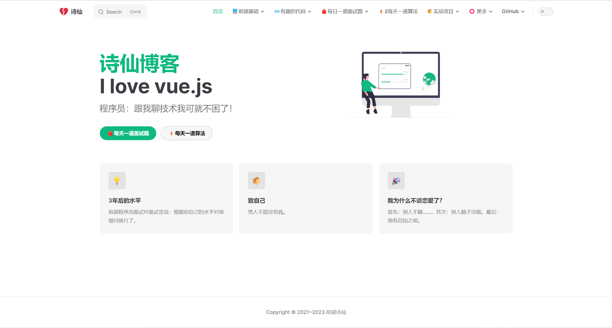

<h1 width="30" height="30"></h1>

# 📖 介绍

> #### 提示： 这仅仅是一篇个人学习过程中的笔记，并不是什么文档。

本项目是由[vuepress](https://xiangyang666.gitee.io/vuepress/)迁移过来的

希望我的博客能把我学到的知识用简单的话说出来。

就像【费曼学习法】，把学到的知识叙述出来，既能了解自己是否掌握，也可以给其他人看！

要在站一个完全不懂的角度去顾及初学者，是一件非常需要耐心和细心的事情。 —— 【知识诅咒】

博客不只是做给自己看的笔记。
每一个【关键词】【专业术语】都有可能让看这篇文章的人困惑一整天....

在某些知识上我也是刚学的。但我还是希望我新学的知识能够把他讲明白，如果讲都讲不明白，我怎么能说我理解了它呢？

笔记/文章，内容与排版、样式持续更新中...

【编程笔记】

【WEB 前端】

【后端】

【面试题 + 算法】

【优质项目】

# ✏️ 对于知识点：

我会先推荐一些相关文章

我会举例子以及说明相关专业术语

# 📌 展示

# 🔢 素材

VuePress 官方文档：https://v2.vuepress.vuejs.org/zh/

VitePress 官方文档: https://vitepress.dev/

博客中的 emoji：https://github.com/markdown-it/markdown-it-emoji/blob/master/lib/data/full.json
