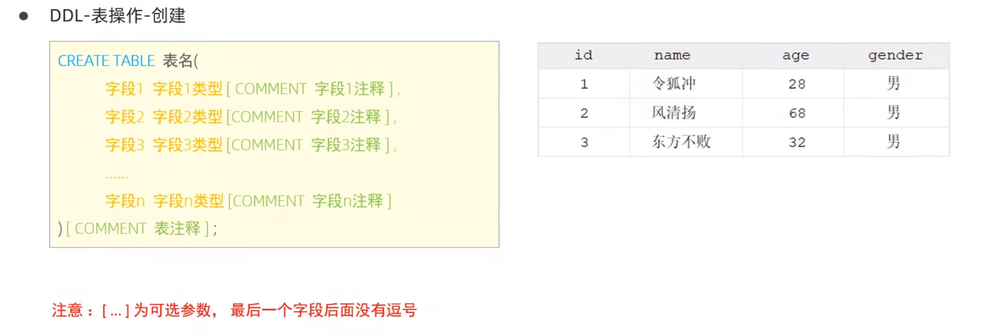
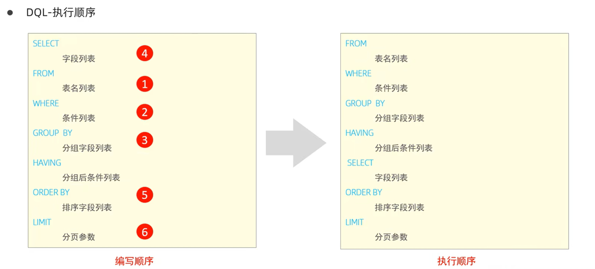
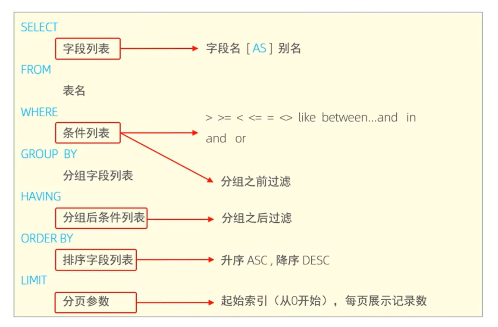
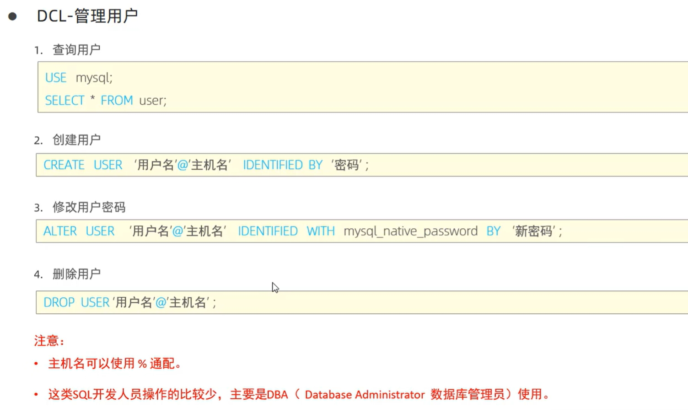
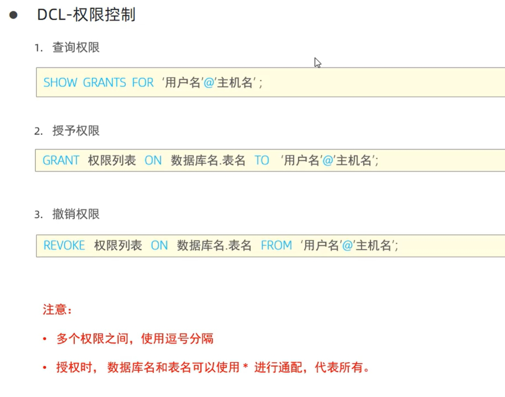
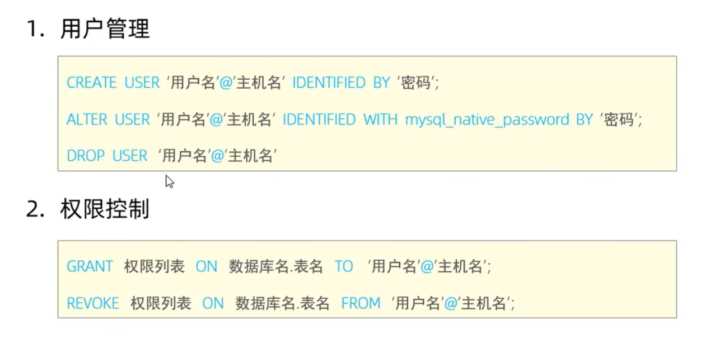

## SQL通用语法

1. SQL语法可以单行或多行书写，以分好结尾。
2. SQL语句可以使用空格/缩进来增强到语句的可读性。
3. MySQL数据库的SQL语句不区分大小写，关键字建议使用大写。
4. 注释：
   + 单行注释：--注释内容 或 # 注释内容（MySQL特有）
   + 多行注释：/*注释内容*/


## SQL分类

| 分类 | 全称                       | 说明                                                   |
| ---- | -------------------------- | ------------------------------------------------------ |
| DDL  | Date Definition Language   | 数据定义语言，用来定义数据库对象（数据库，表，字段）   |
| DML  | Date Manipulation Language | 数据操作语言，用来对数据库表中的数据进行增删改         |
| DQL  | Data Query Language        | 数据查询语言，用来查询数据库中表的记录                 |
| DCL  | Data Control Language      | 数据控制语言，用来创建数据库用户、控制数据库的访问权限 |


## DDL

### DDL-数据库操作

+ 查询

  查询所有数据库

  > show databases;

+ 查询当前数据库

  > select database();

+ 创建

  > create database [if not exists] 数据库名 [default charset 字符集] [collate 排序规则];

+ 删除

  > drop database [if exists] 数据库名;

+ 使用

  > use 数据名;


### DDL-表查询-查询

+ 查询当前数据库所有表

  > show tables;

+ 查询表结构

  > desc 表名;

+ 查询指定表的建表语句

  > show create table 表明;


### DDL-表操作-创建



``` java
create table emp(
    id int comment '编号',
    workno varchar(10) comment '工号',
    name varchar(10) comment '姓名',
    age tinyint unsigned comment '年龄',
    idcard char(18) comment '身份证号',
    entrydate date comment '入职时间'
) comment '员工表';
```


### DDL-表操作-修改

+ 添加字段

  > alter table 表名 add 字段名 类型(长度) [comment 注释] [约束];

+ 修改数据类型

  > alter table 表名 modlfy 字段名 新数据类型(长度);

+ 修改字段名和字段类型

  > alter table 表名 change 旧字段名 新字段名 类型(长度) [comment 注释] [约束];

+ 删除字段

  > alter table 表名 drop 字段名;

+ 修改表名

  > alter table 表名 rename to 新表名;


### DDL-表操作-删除

+ 删除表

  > drop table [if exists] 表名;

+ 删除指定表，并重新创建该表

  > truncate table 表名;

**<span style="color:red;">注意：在删除表时，表中的全部数据也会被删除！</span>**


## DML

DML英文全称是Data Manipulation Language（数据操作语言），用来对数据库中表的数据记录进行增删改操作。

### DML-添加数据

1. 给指定字段添加数据

   >insert into 表名(字段名1，字段名2，......) values (值1, 值2, ...);

2. 给全部字段添加数据

   > insert into 表名 values (值1， 值2, ......);

3. 批量添加数据

   > insert into 表名(字段名1,字段名2,......) values (值1, 值2, ......),(值1, 值2, ......),(值1, 值2, ......);

   > insert into 表名 values (值1, 值2, ......),(值1, 值2, ......),(值1, 值2, ......);

   ``` java
   注意：
       插入数据时，指定的字段顺序需要与值的顺序是一一对应的。
       字符串和日期型数据应该包含在引导中。
       插入的数据大小，应该在字段的规定范围内。
   ```

### DML-修改数据

> update 表名 set 字段名1=值1, 字段名2=值2, ...... [where 条件];

**<span style="color:red;">注意：修改语句的条件可以有，也可以没有，如果没有条件，则会修改整张表的所有数据。</span>**

### DML-删除数据

> delete from 表名 [where 条件];

```java
注意：
    delete语句的条件可以有，也可以没有，如果没有条件，则会删除整张表的所有数据。
    delete语句不能删除某一个字段的值（可以使用update）。
```


## DQL

DQL英文全称是Data Query Language（数据查询语句），数据查询语句，用来查询数据库中表的记录。

1. 查询多个字段

   > select 字段1, 字段2, 字段3 ...... from 表名;

   > select * from 表名;

2. 设置别名

   > select 字段1 [as 别名1], 字段2 [as 别名2], ...... from 表名; 

3. 去除重复记录

   > select distinct 字段列表 from 表名;


### DQL-条件查询

1. 语法

   > select 字段列表 from 表名 where 条件列表;

| 比较运算符         | 功能                                       |
| :----------------- | :----------------------------------------- |
| >                  | 大于                                       |
| >=                 | 大于等于                                   |
| <                  | 小于                                       |
| <=                 | 小于等于                                   |
| =                  | 等于                                       |
| <> 或 !=           | 不等于                                     |
| BETWEEN ... AND... | 在某个范围之内（含最小、最大值）           |
| IN(...)            | 在in之后的列表中的值，多选一               |
| LIKE 占位符        | 模糊匹配（_匹配单个字符，%匹配任意个字符） |
| IS NULL            | 是NULL                                     |

| 逻辑运算符 | 功能                         |
| ---------- | ---------------------------- |
| AND 或 &&  | 并且（多个条件同时成立）     |
| OR 或 \|\| | 或者（多个条件任意一个成立） |
| NOT 或 !   | 非，不是                     |


### DQL-聚合函数

1. 介绍

   将一列数据作为一个整体，进行纵向计算。

2. 常见聚合函数

   | <span style="color:red;background-color:yellow;">函数</span> | <span style="color:red;background-color:yellow;">功能</span> |
   | ------------------------------------------------------------ | ------------------------------------------------------------ |
   | count                                                        | 统计数量                                                     |
   | max                                                          | 最大值                                                       |
   | min                                                          | 最小值                                                       |
   | avg                                                          | 平均值                                                       |
   | sum                                                          | 求和                                                         |

3. 语法

   > select 聚合函数(字段列表) from 表名;

**<span style="color:red;">注意：null不参与所有聚合函数运算。</span>**


### DQL-分组查询

1. 语法

   > select 字段列表 from 表名 [where 条件] group by 分组字段名 [having 分组后过滤条件];

2. where与having区别

   + 执行时机不同：where是分组之前进行过滤，不满足where条件，不参与分组；而having是分组之后对结果进行过滤。
   + 判断条件不同：where不能对聚合函数进行判断，而having可以。


### DQL-排序查询

1. 语法

   > select 字段列表 from 表名 order by 字段1 排序方式1，字段2 排序方式2;

2. 排序方式

   + ASC：升序（默认值）
   + DESC：降序

**<span style="color:red;">注意：如果是多个字段排序，当第一个字段值相同时，才会根据第二个字段进行排序。</span>**


### DQL-分页查询

1. 语法

   > select 字段列表 from 表名 limit 起始索引，查询记录数;


``` my
注意：
  起始索引从0开始，起始索引=（查询页码 - 1）* 每页显示记录数。
  分页查询时数据库的方言，不同的数据库有不同的实现，MySQL中是limit。
  如果查询的是第一个数据，起始索引可以省略，直接简写为limit 10。
```


### 总结






## DCL





### 总结


