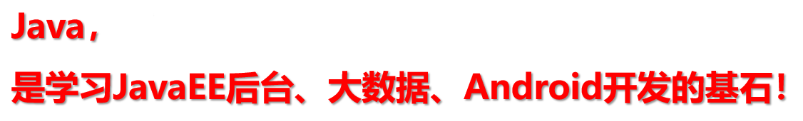

## java之父

> `詹姆斯·高斯林(James Gosling)`先生以“Java 技术之父”而闻名于世。

## java介绍

> Java是一门面向对象编程语言，是一种广泛使用的计算机编程语言，拥有跨平台、面向对象、泛型编程的特性，广泛应用于企业级Web应用开发和移动应用开发。

> - 是`SUN`(Stanford University Network，斯坦福大学网络公司 ) `1995年`推出的一门高级编程语言。
>
> - 是一种面向Internet的编程语言。Java一开始富有吸引力是因为Java程序可以在`Web浏览器`中运行。这些Java程序被称为`Java小程序`（applet），内嵌在HTML代码中。
>
> - 伴随着互联网的迅猛发展，以及Java技术在web方面的不断成熟，已经成为Web应用程序的首选开发语言。

> - 创建于1995年，Java是一种面向对象、基于类的编程语言。
> - Java可能是目前`运用最广的项目语言`。代码稳定性超过 C 和 C++，生产力远超 C 和 C++。有 JVM 在，可以轻松地跨平台。
> - 具有强大的开源开发工具，大量的开源共享库。
> - Java拥有世界上`数量最多`的程序员，最不缺人。



## Java基础路线图


## 什么是计算机语言

+ **语言**：是人与人之间用于沟通的一种方式。例如：中国人与中国人用普通话沟通。而中国人要和英国人交流，可以使用英语或普通话。
+ **计算机编程语言**，就是人与计算机交流的方式。人们可以使用`编程语言`对计算机下达`命令`，让计算机完成人们需要的功能。
+ 计算机语言有很多种。如：C 、C++、Java、Go、JavaScript、Python，Scala等。

> 体会：语言 = 语法 + 逻辑


## 第一个java程序

``` java
class HelloChina {
    public static void main(String[] args) {
        System.out.println("Hello World");
    }
}
```

**注意：**

+ 每一行代码语句结束后都要加上`分号（;）`
+ Java语言是一门严格区分大小写的语言


## Java程序的结构

``` java
类{
    方法{
        语句;
    }
}
```


## Java程序的入口

Java程序的入口是main方法

``` java
public static void main(String[] args){
    
}
```


## 两种常见的输出语句

+ **换行输出语句**：输出内容，完毕后进行换行，格式如下：

``` java
System.out.println(输出内容);
```

+ **直接输出语句**：输出内容，完毕后不做任何处理，格式如下

``` java
System.out.print(输出内容);
```

> 注意事项：
>
> ​	换行输出语句，括号内可以什么都不写，只做换行处理
>
> ​	直接输出语句，括号内什么都不写的话，编译报错


