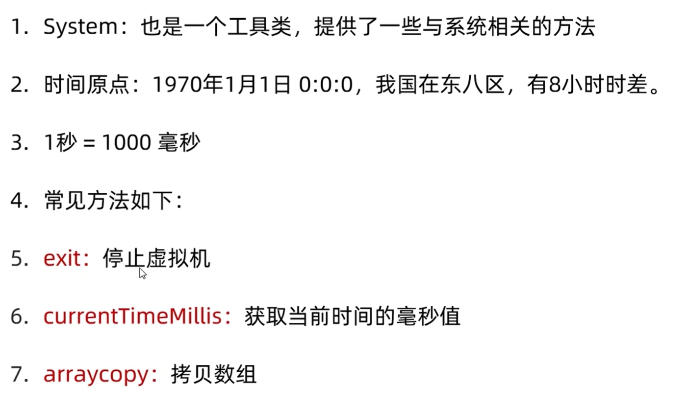
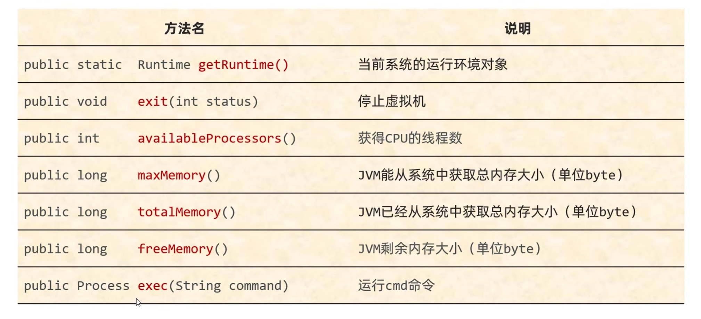

## Math

1. Math：帮助我们进行数学计算的工具类

2. 里面的方法是静态的。

3. 常见方法如下：

   

| abs       | 获取绝对值                 |
| --------- | -------------------------- |
| absExact  | 获取绝对值                 |
| ceil      | 向上取整                   |
| floor     | 向下取整                   |
| round     | 四舍五入                   |
| max       | 获取最大值                 |
| min       | 获取最小值                 |
| pow(a, b) | 获取a的b次幂               |
| sqrt      | 开平方根                   |
| cbrt      | 开立方根                   |
| random    | 获取[0.0, 1.0)之间的随机数 |


## System

**System也是一个工具类，提供了一些与系统相关的方法**

| 方法名                                                       | 说明                         |
| ------------------------------------------------------------ | ---------------------------- |
| public static void exit(int status)                          | 终止当前运行的Java虚拟机     |
| public static long currentTimeMillis()                       | 返回当前系统的时间毫秒值形式 |
| public static void arraycopy(数据源数组, 起始索引, 目的地数组, 起始索引, 拷贝个数) | 数组拷贝                     |

``` java
public static void arraycopy(数据源数组, 起始索引, 目的地数组, 起始索引, 拷贝个数)

// 把arr1数组中的数据拷贝到arr2中
参数一：数据源，要拷贝的数据从哪个数组而来
参数二：从数据源数组中的第几个索引开始拷贝
参数三：目的地，我要把数据拷贝到哪个数组中
参数四：目的地数组的索引
参数五：拷贝的个数

    

    // 细节
    1. 如果数据源数组和目的地数组都是基本数据类型，那么两者的类型必须保持一致，否则会报错
    2. 在拷贝的时候需要考虑数组的长度，如果超出范围也会报错
    3. 如果数据源数组和目的地数组都是引用数据类型，那么子类类型可以赋值给父类类型
```

### 总结




## Runtime

Runtime表示当前虚拟机的运行环境

