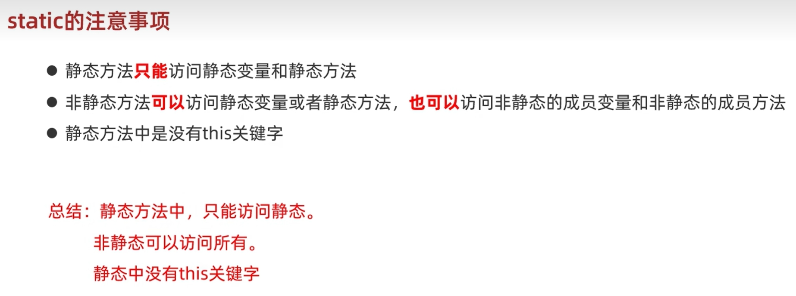
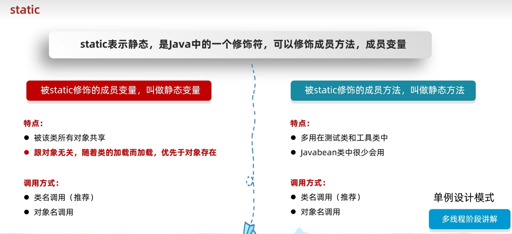
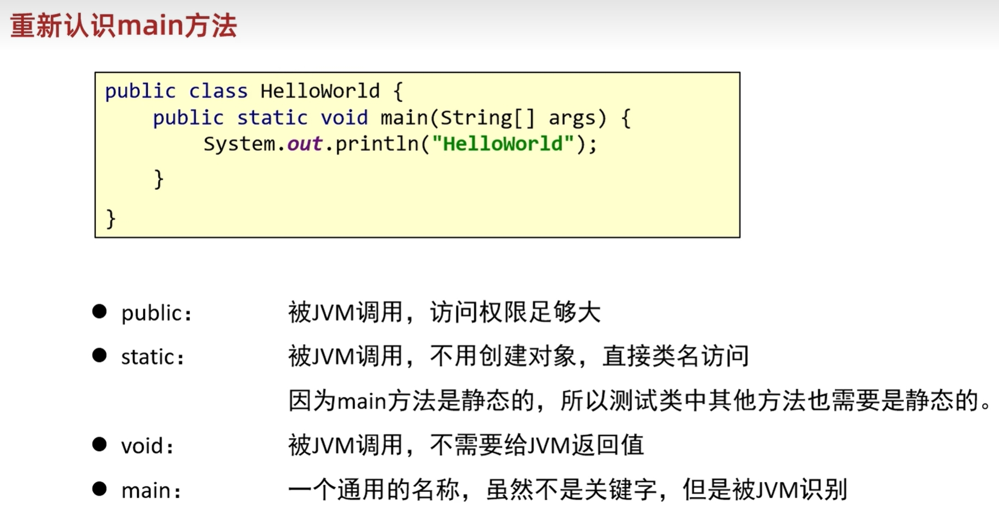

# 面向对象

``` java
/**
格式化代码：Ctrl + Alt + L
	
*/ 
```


## 基础

1. 面向对象内容的三条主线：
   + Java类及类的成员：（重点）属性、方法、构造器；（熟悉）代码块、内部类
   + 面向对象的特征；封装、继承、多态、（抽象）
   + 其他关键字的使用：this、super、package、import、static、final、interface、abstract等

2. 面向过程编程（POP：Process oriented programming）  vs   面向对象编程（OOP：object-oriented programming）

+ 2.1 简单的语言描述二者的区别

+ > 面向过程：

  - 以 “函数” 为组织单位
  - 是一种 “执行者思维”， 适合解决简单问题。扩展能力差、后期维护难度较大。

+ > 面向对象：

  + 以 “类” 为组织单位。每种实物都具备自己的 “属性” 和 “行为/功能”。
  + 是一种 “设计者思维”， 适合解决复杂问题。代码扩展性强、可维护性高。

* 2.2 二者关系

  > 我们千万不要把面向过程和面向对象对立起来。他们是相辅相成的。面向对象离不开面向过程！

3. 面向对象编程的两个核心概念：类（Class）、对象（Object）

   > 谈谈对这两个概念的理解？
   >
   > 类：具有相同特征的事物的抽象描述，是‘抽象的’、概念上的定义。
   >
   > 对象：实际存在的该类事物的"每个个体"，是 “具体的”， 因而也称为“实例（instance）”

5. 面向对象完成具体功能的操作的三步流程（非常重要）
   + 步骤1：创建类，并设计类的内部成员（属性、方法）
   + 步骤2：创建类的对象。比如：Phone p1 = new Phone()
   + 步骤3：通过对象，调用其内部声明的属性或方法，完成相关功能


## 属性

1. 变量的分类：
   + 角度一：按照数据类型来分；基本数据类型（8种）、引用数据类型（数组、类、接口、枚举、注释、记录）
   + 角度二：按照变量在类中声明的位置不同；成员变量（或属性）、局部变量（方法内、方法形参、构造器内、构造器形参、代码块内等）

2. 属性的几个称谓：成员变量、属性、field（字段、域）

3. 区分成员变量     VS     局部变量

   + 3.1 相同点
     + 变量声明的格式相同：数据类型  变量 = 变量值
     + 变量都有其有效的作用域。出了作用域，就失效了
     + 变量必须先声明，后赋值，再使用 

   + 3.2 不同点

     + 1.类中声明的位置不同：

       属性：声明在类内，方法外的变量

       局部变量：声明方法、构造器内部的变量

     + 2.在内存中分配的位置不同（难）

       属性：随着对象的创建，存储在堆空间中。

       局部变量：存储在栈空间中

     + 3.生命周期：

       属性：随着对象的创建而创建，随着对象的消亡而消亡

       局部变量：随着方法对应的栈帧入栈，局部变量会在栈中分配；随着方法对应的栈帧出栈，局部变量消亡

     + 4.作用域：

       属性：在整个类的内部都是有效的

       局部变量：仅限于声明此局部变量所在的方法（或构造器、代码块）中

     + 5.是否可以有权限修饰符进行修饰：

       都有哪些权限修饰符：public、protected、缺省、private。（用于表明所修饰的结构可调用的范围大小）

       属性：是可以使用权限修饰符进行修饰的。（PS：暂时还未讲封装性，所以大小先不用写任何修饰符）。

       而局部变量：不能使用任何权限修饰符进行修饰的。

     + 6.是否有默认值：（重点）

       属性：都有默认初始化值

       ​		意味着，如果没有给属性进行显示初始化赋值，则会有默认初始化值。

       局部变量：都没有默认初始化值。

       ​		意味着，在使用局部变量之前，必须要显式的赋值，否则报错。

``` java
// Employee.java

/**
 * 声明EmployeeTest测试类，并在main方法中，创建2个员工对象，并为属性赋值，并打印两个员工的信息
 *
 * */

public class Employee {

    // 属性
    int id;     // 编号
    String name;  // 姓名
    int age;    // 年龄
    double salary;     // 薪资

}

```

``` java
// EmployeeTest.java

public class EmployeeTest {
    public static void main(String[] args) {
        // 创建类的实例（或创建类的对象，类的实例化）
        Employee emp1 = new Employee();

        System.out.println("emp1内存地址：" + emp1);

        emp1.id = 1001;
        emp1.name = "张三";
        emp1.age = 18;
        emp1.salary = 12999.00;

        System.out.println("id = " + emp1.id + ",name = " + emp1.name + ",age = " + emp1.age + ",salary = " + emp1.salary);


        // 再创建一个Employee的第二个对象
        // Employee emp2 = emp1;  // 错误写法
        Employee emp2 = new Employee();

        emp2.id = 1002;
        emp2.name = "李四";
        emp2.age = 26;
        emp2.salary = 8299.00;

        System.out.println("id = " + emp2.id + ",name = " + emp2.name + ",age = " + emp2.age + ",salary = " + emp2.salary);
    }
}

```


## 方法（method）

1. 使用方法的好处

   方法的理解：“方法” 是类或对象行为特征的抽象，用来完成某个功能操作。

   方法的好处：实现代码重用、减少冗余、简化代码

2. 使用示例

   + Math.random()的random()方法
   + Math.sqrt(x)的sqrt(x)方法
   + System.out.println(x)的println(x)方法
   + new Scanner(System.in).nextInt()的nextInt()方法
   + Arrays类中的binarySearch()方法、sort()方法、equals()方法

3. 声明举例

   ``` java
   public void eat()
   public void sleep()
   public String interests(String hoboy)
   public int getAge()
   ```

4. 方法声明的格式（重点）

   ``` js
   权限修饰符  [其它修饰符] 返回值类型 方法名(形参列表) [throws 异常类型] {   // 方法头
   
   ​          // 方法体
   
   }
   
   注意：[]中的内部不是必须的，以后再说
   ```

5. 具体的方法声明的细节

   5.1 权限修饰符

   ​	① Java规定了哪些权限修饰符呢？有四种：private \ 缺省 \  protected  \  public（放到封装讲）

   ​		暂时大家声明方法时，可以先都写成public的。

   5.2 返回值类型：描述当调用完此方法时，是否需要返回一个结果

   ​	 分类：

   ​			> 无返回值类型：使用void表示即可。比如：System.out.println(x)的println(x)的方法、Arrays类中的binarySearch()方法、sort()方法、equals()方法

   ​			> 有具体的返回值类型：需要指明返回的数据的类型。可以是基本数据类型，也可以引用数据类型

   ​						> 需要在方法内部配合使用 “return  + 返回值类型的变量或常亮”

   ​						比如：Math.random()、new Scanner(System.in).nextInt()等

   ​			【经验】我们在声明方法时，要不要提供返回值类型呢?

   ​						> 根据方法具体实现的功能来决定。换句话说，具体问题具体分析

   ​						> 根据题目要求

   5.3 方法名：属于标识符。需要满足标识符的规定和规范。“见名知意”

   5.4  形参列表：形参，属于局部变量，且可以声明多个。

   ​						格式：（形参类型1  形参1，形参类型2   形参2，.......）

   ​						分类：无形参列表、有形参列表

   ​								> 无形参列表：不能省略一对()。比如：Math.random()

   ​								> 有形参列表：根据方法调用时，需要的不确定的变量的类型和个数，确定形参的类型和个数。

   ​													比如：Arrays类中的binarySearch()方法、sort()方法、equals()方法

   ​							【经验】我们在声明方法时，是否需要形参列表呢？

   ​								> 根据方法具体实现的功能来决定。换句话说，具体问题具体分析

   ​							    > 根据题目要求

   5.5 方法体：当我们调用一个方法时，真正执行的代码。体现了此方法的功能。

6. 注意点

   + java里的方法“不能独立存在”，所有的方法必须定义在类里。
   + Java中的方法不调用，不执行。没调用一次，就执行一次。
   + 方法内可以调用本类中的（其他）方法或属性
   + 方法内不能定义方法。

7. 关键字：return

   7.1 return的作用

   		- 作用1：结束一个方法
   		- 作用2：结束一个方法的同时，可以返回数据给方法的调用者（方法声明中如果有返回值类型，则防范内需要搭配return使用）

   7.2 使用注意点：

   - return后面不能声明执行语句

8. 方法调用的内存解析：

      - 形参：
      - 实参：

​	过程概述：

## 对象数组

1. 什么是对象数组？如何理解？

> 数组的元素可以是基本数据类型，也可以是引用数据类型。当元素是引用类型中的类时，我们称为对象数组。

2. 举例：

> String[]、Person[]、Student[]、Customer[]等

3. 案例：

``` js
/**

1. 定义类Student,包含三个属性：学号number(int)，年级state(int)，成绩score(int)。
2. 创建20个学生对象，学号为1到20，年级和成绩都有随机数确定。
问题一：打印出三年级（state值为3）的学生信息。
问题二：使用冒泡排序按学生成绩排序，并遍历所有学生信息
提示：
①：生成随机数：Math.random()，返回值类型double
②：四舍五入取整：Math.round(double d)，返回值类型long
年级【1,6】：（int）（Math.random() * 6 + 1）
分数[0,100]：（int）（Math.random() * 101）

*/
```

4. 内存解析

## 方法的重载（overload）

1. 定义：在同一个类中，允许存在一个以上的同名方法，只要他们的参数列表不同即可。

   ​			满足这样特征的多个方法，彼此之间构成方法的重载。

2. 总结为：“两同一不同”

​			两同：同一个类、相同的方法名

​			一不同：参数列表不同。①参数个数不同     ②参数类型不同

​			注意：方法的重载与形参的名、权限修饰符、返回值类型都没有关系。

3. 举例

> Array类中sort(xxx[] arr)、binarySearch(xxx[] arr, xxx)、equals(xxx[], yyy[])

4. 如何判断两个方法是相同的呢？（换句话说，编辑器是如何确定调用的某个具体方法呢？）

方法相同，且参数列表相同。（形参列表相同指的是参数个数和类型都相同，与形参名没关系）

要求：在一个类中，允许存在多个相同名字的方法，只要他们的参数列表不同即可。

编辑器是如何确定调用的某个具体的方法呢？先通过方法名确定了一波重载的方法，进而通过不同的参数形参，确定具体的某一个方法。

5. 在同一个类中不允许定义两个相同的方法。

``` java
public void add(int i, int j) {
    
}
public void add(int i, int j, int k) {
    
}
public void add(String s1, String s2) {
    
}
public void add(int i, String s) {
    
}
public void add(String s, int i) {
    
}
```


## 可变个数形参的方法（jdk5.0）

1. 使用场景

在调用方法时，可能会出现方法形参的类型是正确的，但是参数的个数不确定。此时，我们就可以使用可变个数形参的方法


2. 格式：（参数类型   ...   参数名）
3. 说明：

①  可变个数形参的方法在调用时，针对于可变的形参赋的实参的个数可以为：0个、1个或多个

②   可变个数形参的方法与同一类中，同名的多方法之间可以构成重载

③    特例：可变个数形参的方法与同一个类中方法名相同，且与可变个数形参的类型相同的数组参数不构成重载。

④    可变个数的形参必须声明在形参列表的最后

⑤    可变个数的形参最多在一个方法的形参列表中出现一次


## 方法的值传递机制

1. （复习）对于方法内声明的局部变量来说：如果出现赋值操作

	  + 如果是基本数据类型的变量，则将此变量保存的数据值传递出去。
	  + 如果是引用数据类型的变量，则将此变量保存的地址值传递出去。

2. 方法的参数的传递机制：值传递机制

​		2.1 概念（复习）

​		形参：在定义方法时，方法名后面括号()中声明的变量称为形式参数，简称形参。

​		实参：调用方法时，方法名后面括号()中的使用的值/变量/表达式称为实际参数，简称实参。

​		2.2  规则：实参给形参赋值的过程

​				> 如果形参是基本数据类型的变量，则将实参保存的数据值赋给形参。

​				> 如果形参是引用数据类型的变量，则将实参保存的地址值赋给形参。

3. 面试题：Java中的参数传递机制是什么？  值传递。  （不是引用传递）


## 递归方法

1. 何为递归方法？方法自己调用自己的现象就称为递归。
2. 递归方法分类：直接递归、简介递归
3. 使用说明：

+ 递归方法包含了一种“隐式的循环”.
+ 递归方法会“重复执行”某段代码，但这种重复执行无须循环控制
+ 递归一定要向“已知方向”递归，否则这种递归就变成了无穷递归，停不下来，类似于 “死循环”。最终发生 “栈内存溢出”。

注意：

1. 递归调用会占用大量的系统堆栈，内存耗用多，在递归调用层次多时速度要比循环“慢的多”。

   所以在使用递归时要慎用。

2. 在要求高性能的情况下尽量避免使用递归，递归调用既花时间又 “耗内存”。考虑使用循环迭代


## package（包）关键字的使用

package，称为包。用于指明该文件中定义的类、借口等结构所在的包。

### 语法格式

``` java
package 顶层包名.子包名；
```

``` java
// 举例： pack1\pagk2\PackageTest.java
package pack1.pack2;   // 指定类PackageTest属于包pack1.pack2

public class PackageTest{
    public void display() {
        System.out.println("in method display()");
    }
}
```

### 说明

1. 一个源文件只能有一个声明包的package语句
2. package语句作为java源文件的第一条语句出现。若省略该语句，则指定为无名包。
3. 包名，属于标识符，满足标识符命名的规则和规范（全部小写）、见名知意
   - 包通常使用所在工资域名的倒置；com.atguigu.xxx
   - 大家取名时不要使用 “java.xx”包
4. 包对应于文件系统的目录，package语句中用“.”来指明包（目录）的层次，每一次就表示一层文件目录。
5. 同一个包下可以声明多个结构（类、接口），但是不能定义同名的结构（类、接口）。不同的包下可以定义同名的结构


### 作用

1. 包可以包含类和子包，划分“项目层次”，便于管理
2. 帮助“管理大型软件”系统；将功能相近的类划分到同一个包中。比如：MVC的设计模式
3. 解决“类命名冲突”的问题
4. 控制“访问权限”


### JDK中主要的包

`java.lang` ----包含一些Java语言的核心类，如String、Math、Integer、System和Thread，提供常用功能

`java.net`  ----包含执行与网络相关的操作的类和接口

`java.io`  ----包含能提供多种输入/输出功能的类

`java.util`  ----包含一些实用工具类，如定义系统特性、接口的集合框架类、使用与日期日历相关的函数。

`java.text`----包含了一些Java格式化相关的类

`java.sql`----包含了java进行JDBC数据库编程的相关类/接口

`java.awt`----包含了构成抽象窗口工具集（abstract window toolkits）的多个类，这些类被用来构建和管理应用


## import（导入）

> 为了使用定义在其它包中的Java类，需用import语句来显式引入指定包下所需要的类，相当于`import语句告诉编译器到哪里去寻找这个类`。

### 语法

> import 包名.类型;

``` java
// 举例： 
import pack1.pack2.Test;   // import pack1.pack2.*;表示引入pack1.pack2包中的所有结构

public class PackTest{
    public static void main(String args[]) {                                                    
        Test t = new Test();                // Test类在pack1.pack2包中定义
        t.display();
    }
}
```

### 注意事项

+  import语句，声明在包的声明和类的声明之间。
+ 如果需要导入多个类或接口，那么就并列显式多个import即可
+ 如果使用`a.*`导入结构，表示可以导入a包下的所有的结构。举例：可以使用java.util.*的方式，一次性导入util包下所有的类或接口
+ 如果导入的类或接口是java.lang包下的，或者是当前包下的，则可以省略此import语句。
+ 如果已经导入java.a包下的类，那么如果需要使用a包下的类的话，仍然需要导入。
+ 如果在代码中使用不同包下的同名的类，那么就需要使用类的全类名的方式指明调用的是哪个类。
+ （了解）import static 组合的使用；调用指定类或接口下的静态的属性或方法


## 封装性

1. 为什么需要封装性？

理论上：

		+ `高耦合`：类的内部数据细节自己完成，不允许外部干涉
		+ `低耦合`：仅暴露少量的方法给外部使用，尽量方便外部调用

> 通俗的说：把该隐藏的隐藏起来，该暴露的暴露出来。这就是封装性的设计思想

2. 如何实现数据封装？

​	2.1 权限修饰符

​		Java规定了4种权限修饰符，分别是：private、缺省、protected、public

​	2.2 作用

> 我们可以使用4种权限修饰符来修饰类及类的内部成员。当这些成员被调用时，体现可见性的大小。

​	2.3 实际案例：

​	在题目中，我们给Animal的对象的legs属性赋值。在实际的尝试中，我们知道legs不能赋值为负数的。但是如果直接调用属性legs，是不能加入判断逻辑的。那怎么办？


## 构造器（constructor）

1. 构造器的理解

> constructor：n  建设者、建造者
>
> construct：v  建设、建造、创造
>
> construction：n  建设、建造        CCB（中国建设银行）

2. 构造器的作用

作用1：搭配new关键字，创建类的对象

作用2：在创建对象的同时，可以给对象的相关属性赋值

3. 构造器的使用说明

+ 构造器声明的格式：权限修饰符  类名（形参列表）{}
+ 创建类以后，在没有显示提供任何构造器的情况下，系统会默认提供一个空参的构造器与类声明的权限相同
+ 一旦类中显示声明了构造器，则系统不再提供默认的空参的构造器
+ 一个类中可以声明多个构造器，彼此之间构造重载。


## 属性赋值过程

### 一、类中属性（当前仅考虑实例变量）赋值过程

1. 在类中属性中，可以有哪些位置给属性赋值？

   	+ ① 默认初始化
   	+ ② 显示初始化
   	+ ③ 构造器中初始化
   	+ ④ 通过“对象.方法”的方式赋值
   	+ ⑤ 通过“对象.属性”的方式赋值

2. 这些位置执行的先后顺序是怎么样？

   ① - ② - ③ - ④ / ⑤

   

   

3. 以上操作在对象创建过程中可以执行的次数如何？

   > 只能执行一次：①、②、③
   >
   > 可以多次执行：④、⑤

   

   

   


## JavaBean

> JavaBean是一种Java语言写成的可重用组件。

**好比你做了一个扳手，这个扳手会在很多地方被拿去用。这个扳手也提供多种功能（你可以拿这个扳手扳、锤、撬等等），而这个扳手就是一个组件。**

+ 所谓JavaBean，是指符合如下标准的Java类

1. 类是公共的
2. 有一个无参的公共的构造器
3. 有属性，且有对应的get、set方法


## UML类图


## this

> 当前对象（在方法中调用时）或当前正在创建的对象（在构造器中调用时）

1. 2222
2. this可以调用的结构：成员变量、方法、构造器
3. this调用属性和方法

+ 


## 继承性

1. 继承性的理解

> 生活上：财产的继承、颜值的继承
>
> 代码层面：
>
> - 自上而下：定义


## 工具类

> 帮助我们做一些事情，但是不描述任何事物的类

+ javabean类 ：用来描述一类事物的类。比如，Student，Teacher，Dog，Cat等
+ 测试类：用来检查其他类是否书写正确，带有main方法的类，是程序的入口
+ 工具类：不是用来描述一类事物的，而是帮我们做一些事情的类


## static






## 重新认识main方法




## 继承

1. 什么是继承、继承的好处？

​			继承是面向对象三大特征之一，可以让类跟类之间产生子父的关系。

​			可以把多个子类中的重复的代码抽取到父类中，子类可以直接使用，减少代码冗余，提高代码的复用性

2. 继承的格式？

```java
public class 子类 extends 父类 {}
```

3. 继承后子类的特点？

   子类可以得到父类的属性和行为，子类可以使用。

   子类可以在父类的基础上新增其他功能，子类更强大。


总结：

+ Java只能单继承，不能多继承、但是可以多层继承。
+ Java中所有的类都直接或者间接继承于Object类。
+ 子类只能访问父类中非私有的成员


### 继承中：成员变量的访问特点

`就近原则`

+ 先在局部位置找，本类成员位置找，父类成员位置，逐级往上。

1. 如果出现了重名的成员变量怎么办？

   ``` java
   System.out.println(name);       // 从局部位置开始往上找
   System.out.println(this.name);  // 从本类位置开始往上找
   System.out.println(super.name); // 从父类成员位置开始往上找
   ```

   

### 继承中：构造方法的访问特点

+ 子类不能继承父类的构造方法，但是可以通过super调用
+ 子类构造方法的第一行，有一个默认的super()
+ 默认先访问父类中无参的构造方法，再执行自己。
+ 如果想要方法文父类有参构造，必须手动书写

