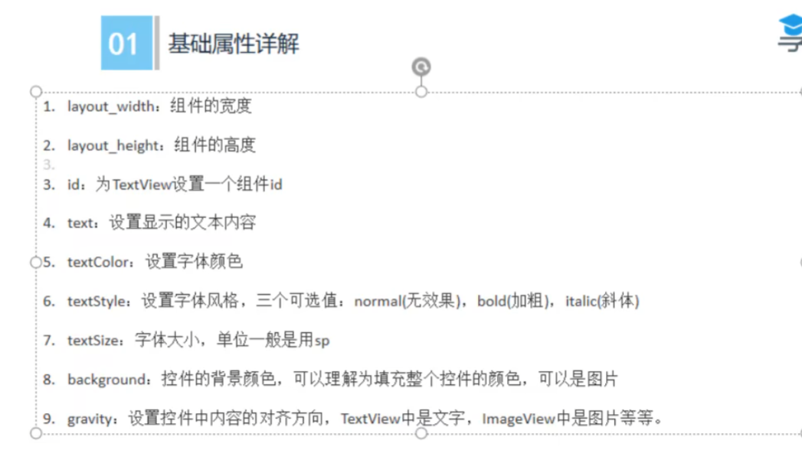
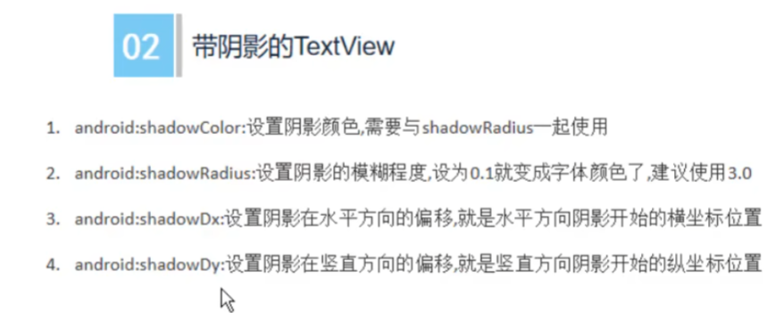
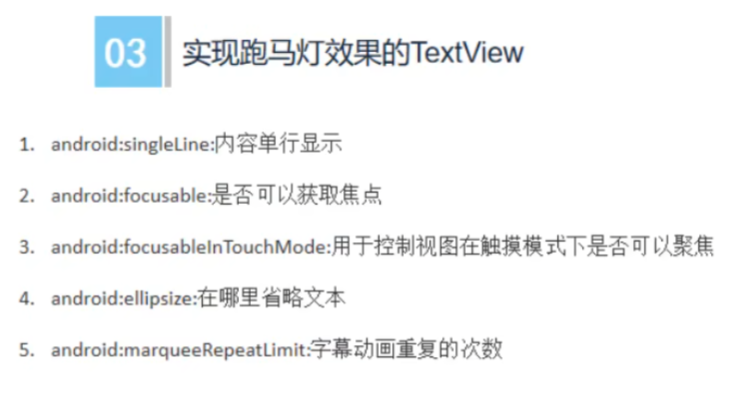

# 移动应用与开发

# 赛项 pdf

http://www.gszjxx.cn/upload/353a68bb-378a-4992-826b-950cd7813631.pdf

gzqcgg.com/static/file/20220322083730408.pdf

https://www.acdt.edu.cn/__local/8/2C/9C/9B8CB090520271D913F2C38E5CD_45431D91_988D8.pdf?e=.pdf

https://blog.csdn.net/synola/article/details/88774022

api 接口（智慧城市）：http://124.93.196.45:10001/pdf/%E6%99%BA%E6%85%A7%E5%9F%8E%E5%B8%82%E5%B9%B3%E5%8F%B0Open%20API_V.3.0.pdf

# 项目目录介绍

```js
YY
  -.gradle
  -.idea
  -app
	  -build
	  -libs
	  -src // 入口文件
	      -main
			    -res
					-layout
                           -activity_main.xml // 入口文件（相当于index.html）
				-AndroidManifest.xml
  -gradle
  -.gitignore
  -build.gradle
  -gradlew
  -gradlew.bat
  -local.properties
  -settings.gradle
```

# 控件

**相当于 html 中的标签**

## TextView



## 带阴影的 Textview



## 实现跑马灯效果的 TextView


