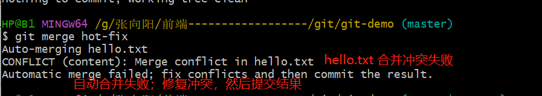
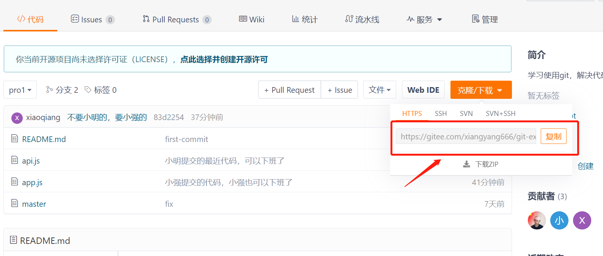
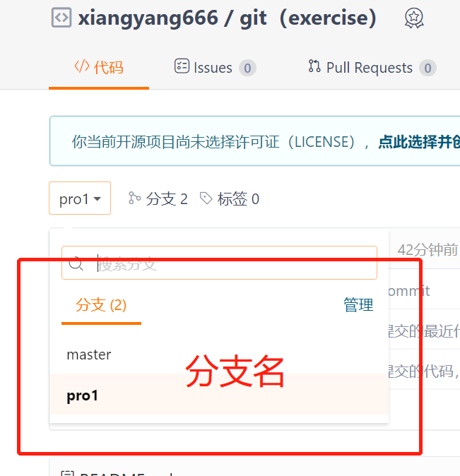
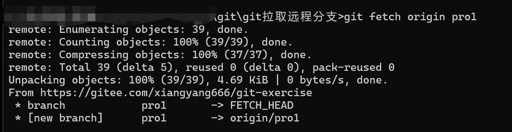
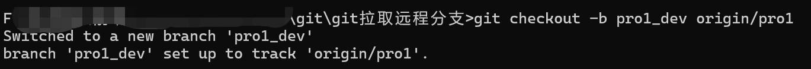

# git

> 菜鸟教程：https://www.runoob.com/git/git-tutorial.html
>
> https://gitee.com/all-about-git
>
> https://blog.csdn.net/qq_46423017/article/details/126437079

> github 打不开这么办：https://www.bilibili.com/video/BV1714y1n7Fz/?spm_id_from=333.851.b_7265636f6d6d656e64.1&vd_source=745d1e6dc172f4afa9af1af10c052b04

> GitHub 使用教程手册（中文）：https://docs.github.com/zh/get-started/quickstart

## 1. 简介

> git 是一个代码管理平台，就是用来管理我们的代码的。

git 的主要平台有 2 个：

一个是国外的 github：全世界的人都在用，在国外，网速慢。

网址：https://github.com/

一个是国内的 gitee：一般是中国人用，在国内，网速快。(码云)

网址：https://gitee.com/***\*（推荐用这个）\****

## 2. 安装（傻瓜式的下一步即可）

> 地址：https://git-scm.com/downloads

```bash
/*
1. 检测git安装成功
  终端中输入 git（如果出现很多版本信息代表安装成功了）

2. 如果安装失败，就要配置一下电脑的环境变量
  步骤：此电脑(右键)》属性》高级系统设置》环境变量》环境变量（双击Path）》新建（将git的安装路径填写进去）》确定即可

*/
```

## 3. git 工作原理

一般工作流程如下：

- 克隆 Git 资源作为工作目录。
- 在克隆的资源上添加或修改文件。
- 如果其他人修改了，你可以更新资源。
- 在提交前查看修改。
- 提交修改。
- 在修改完成后，如果发现错误，可以撤回提交并再次修改并提交。

下图展示了 Git 的工作流程：


## 4. git 操作基本命令

### 仓库

```bash

# 在当前目录新建一个Git代码库
git init

# 新建一个目录，将其初始化为Git代码库
git init [project-name]

# 下载一个项目和它的整个代码历史
git clone [url]
```

### 配置

```bash
# 显示当前的Git配置
git config --list

# 编辑Git配置文件
git config -e [--global]

# 查看当前仓库的信息
git config --local -l

# 设置提交代码时的用户信息（如果去掉 --global(换成--local) 参数只对当前仓库有效）
git config --global user.name "[name]"
git config --global user.email "[email address]"
```

### 提交代码一些命令

```bash
查看指定文件状态
git status [filename]

查看所有文件状态
git status

将index文件从》工作区 放进 》 暂存区
git add index.html

	添加所有文件放到暂存区
	git add .

将所有在 暂存区》 的内容 全部提交到》 版本区   -m为提交信息
git commit -m “add a file”

自己要与origin master建立连接（后面的地址为远程仓库链接）--这一步是初始化项目时做的
git remote add origin https://gitee.com/xiangyang666/test03.git

将 版本区 的所有内容 全部提交到 gitee 平台上了
git push
git push origin master		//master是默认分支名，这里可以根据自己需要进行修改


克隆别人的代码（首先到gitee里找到想要的代码，然后把链接复制下来，执行下面的代码即可）
git clone https://gitee.com/lele-666/V-IM.git

克隆指定的分支：git clone -b 分支名  仓库地址
	克隆某分支到本地目录，然后在该目录下push时，对应的就是push到远端的对应分支。

// 强制push提交代码
git commit --no-verify -m '第二天'结束'


--------------------------注意-----------------------------------
// -a 参数设置修改文件后不需要执行 git add 命令，直接来提交  // 如果新添加了文件，他是不会提交的，还是要用 git add .
git commit -am '提交信息'

```

### 回滚（回到想要的代码版本）

```bash
# 回滚到之前的版本
- 查看所有版本信息（查不到回滚前的那个版本信息）
git log
- 回滚命令
git reset --hard 版本号

# 回滚到之后的版本
- 查看所有版本（可以查到以前版本信息）
git reflog
- 回滚命令
git reset --hard 版本号

```

## 5. 分支

分支在 git 中相对较难，分支就是科幻电影里的平行宇宙，如果两个平行宇宙互不干扰，那对现在的你也没啥影响。不过，在某个时间点，两个平行宇宙合并了，我们会需要处理一些问题了！

```bash
# 列出所有本地分支
git branch

# 列出所有远程分支
git branch -r

# 新建一个分支，但依然停留在当前分支
git branch [branch-name]

# 新建一个分支，并切换到该分支
git checkout -b [branch]

# 合并指定分支到当前分支
git merge [branch]

# 删除分支
git branch -d [branch-name]

# 删除远程分支
git push origin --delete [branch-name]
git branch -dr [remote/branch]
```

**如果同一个文件在合并分支时都被修改了则会引起冲突：解决的办法是我们可 u 一修改冲突文件后重新提交！**

**master 主分支应该非常稳定，哦你过来发布新版本，一般情况下不允许在上面工作，工作一般情况下在新建的 dev 分支上工作，工作完后，比如说 dev 分支支持代码稳定后可以合并到主分支 master 上来**

## 6.git 忽略文件

有些时候我们不想把某些文件纳入版本控制中，比如数据库文件，临时文件，设计文件等

在主目录下建立`.gitignore`文件，此文件有如下的规则：

1. 忽略文件中的空行或以井号（#）开始的行将会被忽略
2. 可以适应 Linux 通配符。例如：星号（\*）代表任意多个字符，问号（？）代表一个字符，方括号（[abc]）代表可选字符范围，大括号（{string1，string2......}）代表可选的字符串等。
3. 如果名称的最前面有一个感叹号（！），代表例外规则，将不被忽略。
4. 如果名称的最前面是一个路径分隔符（/）。表示要忽略的文件在此目录下，二字母率中的文件不忽略。
5. 如果名称的走后面是一个路径分隔符（/），表示要忽略的是目录下该名称的子目录，而非文件按（默认文件或目录都忽略）。

```js
#为注释
*.txt 		忽略所有 .txt结尾的文件
!lib.txt	但lib.txt除外
/temp		仅忽略项目根目录的TODO文件，不包括其他目录temp
build/		忽略build/目录下的所有文件
doc/*.txt	会忽略 doc/*.txt 但不包括   doc/server/arch.txt
```

## 7. git 拉取远程分支

### 1. 直接拉取（当本地并没有任何记录时拉取）

```bash
git clone -b ants git@github.com:Ants-double/CareerJava.git
git clone -b 远程分支名  仓库地址
```

### 2. 本地已经有相关的仓库代码

```bash
//查看远程分支
git branch -r
//创建本地分支并关联
git checkout -b 本地分支 origin/远程分支

//已有本地分支创建关联
git branch --set-upstream-to origin/远程分支名  本地分支名
//拉取
git pull
```

### 3.

1. 新建一个空文件夹，文件名为 test
2. 初始化

```js
git init
```

3.自己要与 origin master 建立连接（后面的地址为远程仓库链接）

```js
git remote add origin https://gitee.com/xiangyang666/test03.git
```

4、把远程分支拉到本地

```js
git fetch origin dev（dev为要拉取的远程仓库的分支名）
// git fetch origin project01       这里的 project01 是远程仓库的分支名
```

5、在本地创建分支 dev 并切换到该分支

```js
git checkout -b dev(本地分支名称) origin/dev(远程分支名称)
```

6、把某个分支上的内容都拉取到本地

```js
git pull origin dev(远程分支名称)
```

## 8.将本地文件上传到 Gitee

```bash
# 查看所有文件状态(这步可省略)
git status

# 添加所有文件放到暂存区
git add .

# 将所有在 暂存区》 的内容 全部提交到》 版本区   -m为提交信息
git commit -m “数据接口代码”
```


```bash
#将 版本区 的所有内容 全部提交到 gitee 平台上
git push

注意：（可以修改分支）
git push origin master		//master是默认分支名，这里可以根据自己需要进行修改
```

## 9.遇到的一些问题

> error: remote origin already exists.

```js
1、先删除远程 Git 仓库
git remote rm origin

2、再添加远程 Git 仓库
git remote add origin https://gitee.com/xiangyang666/test03.git
```

## 10. 常用命令操作

### 公司、回家写代码流程

#### 在家里上传代码

```js
1. 给远程仓库起别名
	git remote add origin 远程仓库地址
2. 向远程推送代码
	git push -u origin 分支(master)
```

#### 到公司新电脑第一次获取代码

```js
1. 克隆远程仓库代码
	git clone 远程仓库地址（内部已实现git remote add origin 远程仓库地址）
2. 切换分支
	git checkout 分支
```

#### 在公司进行开发

```js
1. 切换到dev分支进行开发
	git checkout dev
2. 把master分支合并到dev【仅一次】
	git merge master
3. 修改代码
4. 提交代码
	git add .
	git commit -m 'xxx'
	git push origin dev
```

#### 回到家继续写代码

```js
1. 切换到dev分支进行开发
	git checkout dev
2. 拉代码
	git pull origin dev
3. 继续开发
4. 提交代码
	git add .
    git commit -m 'xxx'
	git push origin dev
```

#### 在公司继续开发

```js
1. 切换到dev分支进行开发
	git checkout dev
2. 拉代码
	git pull origin dev
3. 继续开发
4. 提交代码
	git add .
	git commit -m 'xxx'
	git push origin dev
```

#### 开发完毕，要上线

```js
1. 将dev分支合并到master，进行上线
	git checkout master
	git merge dev
	git push origin master
2. 把dev分支也推送到远程
	git checkout dev
	git merge master
	git push origin dev
```

### 查看历史版本

```bash
git reflog	查看精简版本信息

git log	    查看版本详细信息   (如果嫌弃输出的信息杂乱无章，那么加上 –pretty=oneline)
git log --pretty=oneline
```

### 版本穿梭

回滚（回到想要的代码版本）

```bash
# 回滚到之前的版本
- 查看所有版本信息（查不到回滚前的那个版本信息）
git log
- 回滚命令
git reset --hard 版本号

# 回滚到之后的版本
- 查看所有版本（可以查到以前版本信息）
git reflog
- 回滚命令
git reset --hard 版本号


[git] 回滚到特定版本，并更新远程库
本地分支回滚到指定版本
git reset --hard <commit ID号>
强制推送到远程分支
git push -f origin <branch name>
```

### 分支的操作

```js
// 查看分支      // 精简分支信息（不加-v）   git branch
git branch -v
// 创建分支
git branch 分支名
// 切换分支
git checkout 分支名
// 把指定的分支合并到当前分支上
git merge 分支名
```

### 分支合并冲突




### 团队内协作

[视频链接](https://www.bilibili.com/video/BV1vy4y1s7k6?p=24&vd_source=745d1e6dc172f4afa9af1af10c052b04)

### 跨团队协作

[视频链接](https://www.bilibili.com/video/BV1vy4y1s7k6?p=25&vd_source=745d1e6dc172f4afa9af1af10c052b04)

### git 拉取远程分支

- 1、初始化文件夹

```bash
git init
```

- 2、自己要与 origin master 建立连接，（如下图红框内所示的链接）



```bash
git remote add origin [远程仓库链接]
```

- 3、把远程分支拉取到本地





```bash
git fetch origin [远程仓库的分支名]
```

- 4、把本地创建分支 dev 并切换到该分支



```bash
git checkout -b pro1_dev(本地分支名称) origin/pro1(远程分支名称)

例如：
git checkout -b pro1_dev origin/pro1
```

- 5、把某个分支上的内容都拉取到本地

```bash
git pull origin dev(远程分支名称)
```


## 11. git 删除服务器最后一次提交

``` js
// 方式一：
// 1. 执行
	git reset --hard HEAD^
// 2. 强制推送本地代码到远端
	git push --force
```

``` js
// 方式二：
// git revert是用一次新的commit来回滚之前的commit，此次提交之前的commit都会被保留

// git revert  前一次commit id
```

