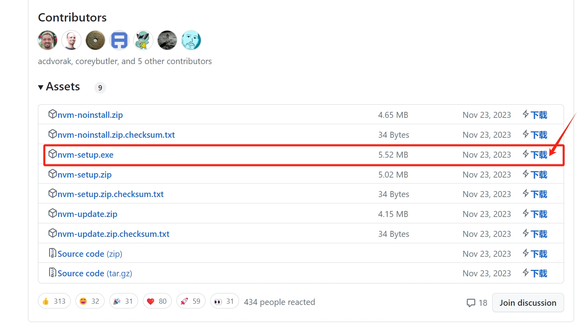
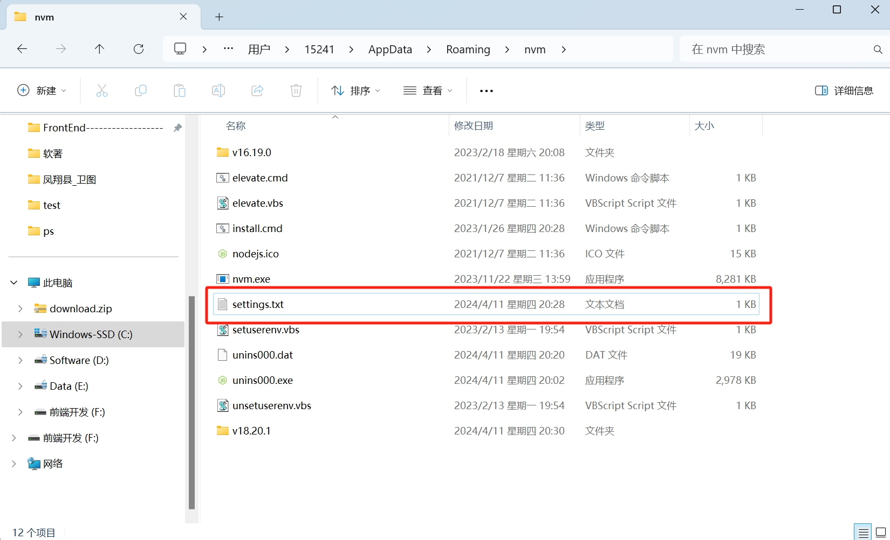
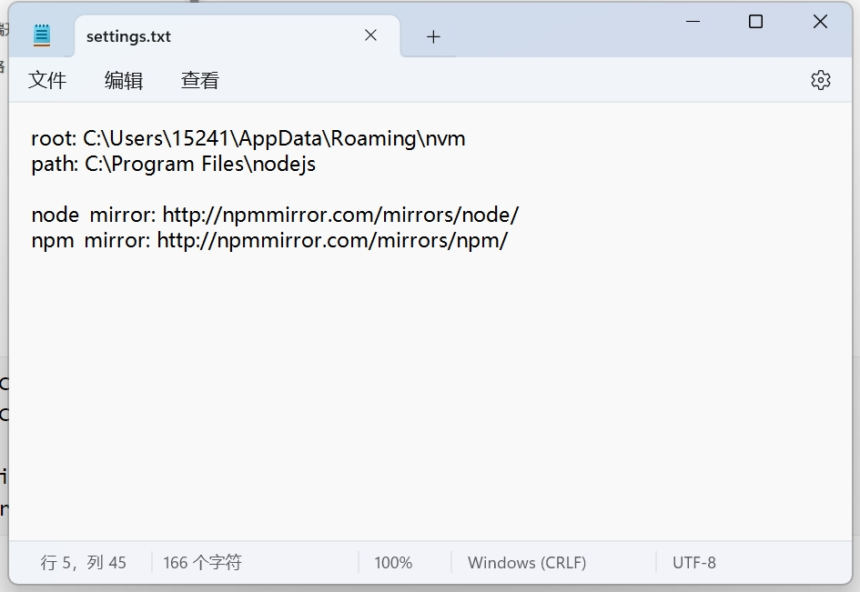
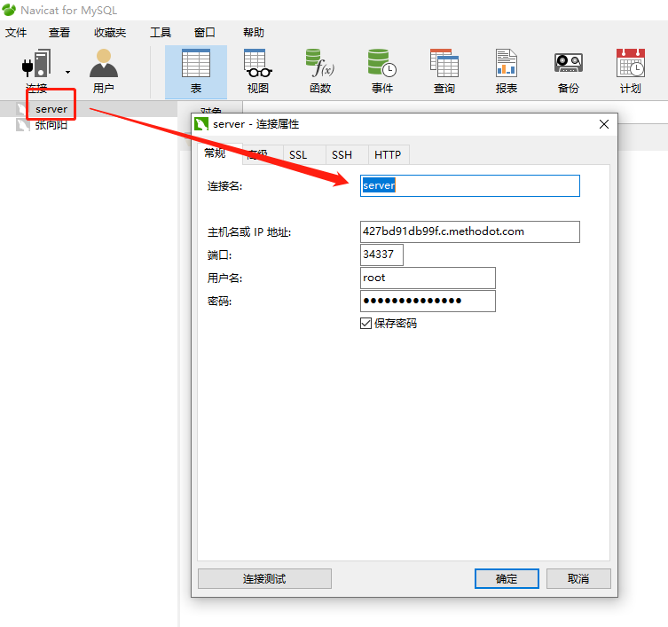

## Node.js

Node.js 是一个基于 Chrome V8 引擎的 JavaScript 运行的环境

初学者的 Node.js 使用指南：https://mp.weixin.qq.com/s/_Jf8zKlVy1HV5IQlWTlbbg

## nvm

> 很多时候，不同的项目需要不同的[node版本](https://so.csdn.net/so/search?q=node版本&spm=1001.2101.3001.7020)，我们不断的切换版本来开发项目，一次次的卸载安装效率非常低，所以我们可以使用nvm（node版本管理器）来管理node的版本，在每次使用不同的版本时，就可以通过nvm来切换node版本

### 1. nvm安装

先我们下载nvm，下载地址：https://github.com/coreybutler/nvm/releases，我们下载setup的安装版，如下图


### 2. 安装node

**安装成功后即可通过nvm命令进行安装node，如**

``` js
nvm install 14.7.0 // 安装14.7.0版本的nodejs
```


**当安装多个node版本时，可以使用nvm use 版本号进行版本切换**

``` js
nvm use 14.7.0
```


### 看安装在本机的所有node.js版本

``` js
nvm ls
```


**查看本地nvm有哪些node版本**

``` js
nvm list
```


**删除不要的版本**

``` js
nvm uninstall <version> 
```


**查显示可以安装的所有node.js的版本**

``` js
nvm list available
```


### 3. 切换node版本成功！！！


## nvm（2024-4-11）

### 一、NVM简介

**nvm是一个方便的node版本管理工具，可以解决项目开发中遇到的node版本不匹配的问题。他能够安装和使用指定的node版本，让node的安装和切换变得简单方便。使用nvm可以避免重新安装node的繁琐步骤，提高项目开发效率。**

### 二、NVM安装

安装包下载地址：https://github.com/coreybutler/nvm-windows/releases



``` js
nvm -v     // 查看是否安装完成
nvm list available 	// 显示可以安装的node.js版本
nvm install 18.20.1  // 安装node.js的命名18.20.1是版本号
nvm list	// 查看已安装的node.js
nvm use 18.20.1   // 切换到使用指定的node.js版本
```

### 三、设置镜像

**打开nvm安装目录，修改setting.txt**







``` js
root: C:\Users\15241\AppData\Roaming\nvm
path: C:\Program Files\nodejs

node_mirror: http://npmmirror.com/mirrors/node/ 
npm_mirror: http://npmmirror.com/mirrors/npm/
```


## 局域网和互联网的区别

```js
/*
互联网（WAN）就是我们每天上的网，理论上来说互联网就是最大的网络。如果你的计算机接入了网络，从理论上说就是互联网的一部分了。如果断网了，就不属于互联网了。他的信息量十分的巨大。不同国家的互联网可能是通过越洋电缆去连接的。


局域网（LAN）(Local Area Network)就是一个小范围内的网络，可能是10公里以内，也可能是一个公司的网络。特点就是小范围传输的速度特别快。就像我们以前的“CS”、“魔兽世界”。网吧就是一个局域网。而互联网（广域网）就是由一个一个的城域网、小的广域网和局域网组成。
*/
```

## 报错问题

### 1.**安装插件时**(报错)

```js
node : 无法将“node”项识别为 cmdlet、函数、脚本文件或可运行程序的名称。请检查名称的拼写，如果包括路径，请确保路径正确，然后再试一次。
所在位置 行:1 字符: 1
+ node -v
+ ~~~~
+ CategoryInfo          : ObjectNotFound: (node:String) [], CommandNotFoundException
 + FullyQualifiedErrorId : CommandNotFoundException
```

解决方法：`npm install -g npm`

### 2. 通过 nodemon 启动项目

```js
nodemon : 无法加载文件 C:\Users\HP\AppData\Roaming\npm\nodemon.ps1，因为在此系统上禁止运
行脚本。有关详细信息，请参阅 https:/go.microsoft.com/fwlink/?LinkID=135170 中的 about_Execution_Policies。                                                                         脚本。有关详细信息，请参阅 https:/go.microsoft.com/fwlink/?LinkID=135170 中的 about_Execution_Policies。
所在位置 行:1 字符: 1
+ nodemon .\app.js
+ ~~~~~~~
    + CategoryInfo          : SecurityError: (:) []，PSSecurityException
    + FullyQualifiedErrorId : UnauthorizedAccess
```

解决方法：

```js
// 1. 以管理员的身份运行 PowerShell
输入：（选择 Y 回车）
	set-ExecutionPolicy RemoteSigned

// 2. 查看是否修改成功：
	get-ExecutionPolicy
//  返回 RemoteSigned 即可
```

## node.js 基础

### 1.读取指定文件中的内容

语法： **fs.readFile(path[, options], callback)**

参数一：必选参数，字符串，表示文件的路径

参数二：可选参数，表示以什么编译格式来读取文件

参数三：必选参数，文件读取完成后，通过回调函数拿来读取的结果（回调的参数：参数一：error：表示读取失败的信息，参数二：data：表示读取成功后的数据）

```js
// 例如：
// 导入fs模块
const fs = require("fs");

fs.readFile("./01-url.js", "utf-8", (error, data) => {
  // 如果错误
  if (error) console.log("读取失败！！！");
  // 成功
  console.log(data);
});
```

### 2.向指定文件中写入内容

语法： **fs.writeFile(file, data[, options], callback)**

参数一：必选参数，需要指定一个文件路径的字符串，表示文件的存放路径

参数二：必选参数，表示写入的内容

参数三：可选参数，表示以什么格式写入文件内容，默认值是 utf-8

参数四：必选参数，文件写入完成后的回调函数

```js
// 例如：
const fs = require("fs");

fs.writeFile("./test文件夹/写入后的文件.txt", "hello world", (error, data) => {
  if (error) console.log("写入失败");

  console.log(data, "写入成功");
});
```

**fs 模块——路径动态拼接的问题**

在使用 fs 模块操作文件时，如果提供的操作路径是以 ./ 或 ../ 开头的相对路径时，很容易出现路径动态拼接错误的问题

原因：代码在运行的时候，会以执行 node 命令时所处的目录，动态拼接处操作文件的完整路径

解决方案：在使用 fs 模块操作文件时，直接提供完整的路径（但这会不利于维护，移植性非常差），不要提供 ./ 或 ../ 开头的相对路径，从而防止路径动态拼接的问题

**\_\_dirname** 表示当前文件所处的目录

### 3.什么是 path 路径模块

path 模块是 Node.js 官方提供的，用来处理路径的模块。提供了一系列方法和属性，用来满足用户对路径的处理

**首先必须先导入系统模块: `const path = require('path')`**

1. path.join() 把多个路径片段拼接为完整的路径字符串

   语法：path.join( [...paths] )

参数：...paths：《string》 路径片段序列

```js
// 例如：
// 先导入path模块
const path = require("path");

const str = path.join("/a", "/b/c", "../", "/d", "./", "/e");
// 注意：../会抵消前一个字符串
console.log(str); //打印结果为：\a\b\d\e

const str2 = path.join(__dirname, "./02-读取文件.js");
console.log(str2); //打印结果为：F:\张向阳综合文件\node.js\复习nodejs\01-内置模块\02-读取文件.js
```

2. path.basename() 获取路径中的最后一部分，经常通过这个方法获取路径中的文件名

   语法：path.basename( path[, ext] )

   参数：path：《string》必选参数，表示一个路径的字符串

    ext：《string》可选参数：表示文件扩展名

   ```js
   // 例如：
   const fpath = "C:/nodejs文件夹/index.html"; // 路径字符串

   let fullName = path.basename(fpath);
   console.log(fullName); // 打印结果为：index.html

   let nameWithOutExt = path.basename(fullName, ".html");
   console.log(nameWithOutExt); // 打印结果为：index
   ```

3. path.extname 获取路径中的扩展名部分

   语法：path.extname( path )

   参数：path: 《string》 必选参数，表示一个路径的字符串

   ```js
   //例如：
   const fpath2 = "C:/nodejs文件夹/index.vue"; // 路径字符串
   
   const fext = path.extname(fpath2);
   console.log(fext); // 打印结果为：.vue
   ```

### 4.什么是 http 模块

在网络节点下，负责消费资源的电脑，叫做客户端；负责对外提供网络资源的电脑，叫做服务器

**http 模块是 node.js 官方提供的，用来创建 web 服务器的模块。**

必须先使用 http 模块创建 web 服务器，则需要先导入它 `const http = require('http')`

**IP 地址**就是互联网上每台计算机的**唯一地址**。

**127.0.0.1** 对应的域名是 **localhost**

注意：

 每个端口号不能同时被多个 web 服务器占用，

 在实际应用中，URL 中的 80 端口 可以被省略。

#### 创建一个最基本的 web 服务器

```js
// 1.导入http模块
const http = require("http");

// 2.创建web服务器实例
const server = http.createServer();

// 3.为服务器实例绑定 request 事件
// 	 使用服务器实例的 .on() 方法，为服务器绑定一个 request 事件
server.on("request", (request, response) => {
  console.log(request.socket.remoteAddress); //这个可以获取IP地址（远程 IP 地址的字符串表示形式）
  console.log("someone vist our web server");
  // 只要有客户端来请求我们自己的服务器，就会触发 reques 事件，从而调用这个事件处理函数
});

// 4.启动服务器
//   调用服务器实例的 . listen() 方法，即可启动当前的web服务器实例
//   调用 server.listen(端口号，callback回调)方法，即可启动web服务器
server.listen(8080, () => {
  console.log("http server running at http://127.0.0.1:8080");
});
```

#### request 请求对象

它包含了与客户端相关的数据和属性。例如：

 request.url 表示客服端请求的 URL 地址

 request.method 表示客户端的 method 请求类型

#### response 响应对象

在服务器的 request 事件处理函数中，如果想访问与服务器相关的数据或属性。例如：

 response.end()

 作用：想客户端发送指定的内容，并结束这次请求的处理过程

#### 解决中文乱码问题

 当调用 response.end 方法，向客户端发送中文内容的时候，会出现乱码问题，此时，需要手动设置内容的编码格式。

```js
// 如下：
server.on('request', (request,response) => {
    // 发送的内容中包含中文
    let str = 'url地址为：http://www.baidu.com',

    // 防止中文显示乱码的问题，需要设置响应头 Content-Type 的值为：text/html;charset=utf-8
    response.setHeader('Content-Type','text/html;charset=utf-8')

    //把含有中文的内容，响应给客户端
    response.emd(str)
})
```

## 模块化

编程领域中的模块化，就是遵循固定的规则，把一个大文件拆成独立并互相依赖的多个小模块

把代码进行模块化拆分的好处：

1. 提高了代码的复用性
2. 提高了代码的可维护性
3. 可以实现按需加载

### 1.加载模块

 require()方法，可以加载需要的内置模块，用户自定义模块，第三方模块进行使用（使用 require()方法加载其它模块时，会执行被加载模块中的代码）

```js
// 例如：
// 加载内置的fs模块
const fs = require("fs");

// 加载用户的自定义模块
const index = require("./index.js"); // 可以省略 .js 的后缀名

// 加载第三方模块
const alt_template = require("alt_template");
```

### 2.向外共享模块作用域中的成员

1. module 对象

   在每个.js 自定义模块中都有一个 module 对象，它里面存储了和当前模块有关的信息

2. module.exports 对象

   在自定义模块中，可以使用 module.exports 对象，将模块内的成员共享出去，供外界使用。

   外界用 require()方法导入，自定义模块时，得到的就是 module.exports 所指的对象

**注意**：**在一个自定义模块中，默认情况下，module.exports = { }**

```js
// 例如：
// 这是 01-module.exports.js 文件
// 向 module.exports 对象上挂载 userMessage 属性
module.exports.userMessage = "张三是个大帅逼";

// 向 module.exports 对象上挂载 sayHello 方法
module.exports.sayHello = function () {
  console.log("hello world");
};

// 这是 server.js 文件
// 导入自定义模块
const m = require("./01-module.exports.js");
console.log(m); //{ userMessage: '张三是个大帅逼', sayHello: [Function (anonymous)] }
```

### 3.共享成员的注意点

 使用 require()方法导入模块时，导入的结果，永远以 module.exports 指向的对象为准

### 4.exports 对象

由于 module.exports 单词写起来比较复杂，为了简化向外共享成员的代码。

Node 提供 exports 对象。默认情况下，exports 和 module.exports 指向同一个对象,最终共享的结果，还是以 module.exports 指向的对象为准。

```js
// 向 module.exports 对象上挂载 userName 属性
exports.userName = "李四";

// 向 module.exports 对象上挂载 sayHello 方法
exports.sayHello = function () {
  console.log("hello world");
};

// 导入一个自定义模块
const m = require("./02-exports.js");
console.log(m); //{ userName: '李四', sayHello: [Function (anonymous)] }
```

### 5.exports 和 module.exports 的使用误区

时刻谨记，require() 模块时，得到的永远是 moudle.exports 指向的对象

注意：为了防止混乱，建议大家不要在同一个模块中使用 exports 和 module.exports

## npm 与 包

命令：

```bash
# 设置淘宝镜像
npm config set registry http://registry.npm.taobao.org/
# 切换npm镜像
npm config set registry https://registry.npmjs.org/
# 查看源
npm config get registry
```

**概念**

1.`npm`下包默认是去 npm 的官网地址下载

1.切花为国内的`源`,可以一定程度提速

```bash
// cmd基本命令
cls 清屏
// 创建文件夹   mkdir git
mkdir + 文件名

npm i  === npm install   下载

npm uninstall   卸载

npm i -g express  全局安装

npm i --save 会把依赖包名称添加到 package.json 文件 默认为dependencies 键下

npm i --save-dev 把依赖包名称添加到 package.json 文件 devDependencies 键下


npm i xxx -D      就是 npm i express --save-dev

npm i xxx -S      就是 npm i express --save
```

---

## Express

官方给出的概念：Express 是基于 Node.js 平台,快速，开放，极简的 web 开发框架

### 1. express 基础

#### 1.使用 express 创建一个最基本的 web 服务器

```js
// 1.导入exress框架
const express = require("express");

// 2.创建web服务器
const app = express();

// 3.当用户访问 / 地址时就响应内容
app.get("/", (req, res) => {
  res.send("你好 express!!!");
});

// 4.启动web服务器
app.listen(3000, () => {
  console.log("express server running at http://127.0.0.1:3000");
});
```

#### 2.监听 GET 和 POST 请求

```js
// 1.监听GET请求
通过 app.get() 方法，可以监听客户端的 GET 请求，具体的语法格式如下：
app.get('请求URL', function(request,response) {
    /*处理函数*/
})
// 参数一：客户端请求的 URL 地址
// 参数二：请求对应的处理函数
//		  request：请求对象（包含了对请求相关的属性与方法）
// 		  response：请求对象（包含了对响应相关的属性与方法）

// 2.监听POST请求
通过 app.post() 方法，可以监听客户端的 POST 请求，具体的语法格式如下：
app.post('请求URL', function(request,response) {
    /*处理函数*/
})
// 参数一：客户端请求的 URL 地址
// 参数二：请求对应的处理函数
//		  request：请求对象（包含了对请求相关的属性与方法）
// 		  response：请求对象（包含了对响应相关的属性与方法）
```

```js
// 例如：
const express = require("express");
const app = express();

// 监听GET请求
app.get("/user", (req, res) => {
  res.send({
    name: "张三",
    age: 18,
    gender: "男",
  });
});
// 监听GPOST请求
app.post("/user", (req, res) => {
  res.send("POST请求成功");
});

app.listen(3000, () => {
  console.log("express server running at http://127.0.0.1:3000");
});
```

#### 3.把内容响应给客户端

 **通过 response.send() 方法，可以把处理好的内容，发送给客户端**

#### 4.获取 URL 中携带的查询参数

 通过 **request.query** 对象，可以访问到客户端通过查询字符串的形式，发送到服务器的参数：

```js
app.get("/", (request, response) => {
  // request.query 默认是一个空对象
  // 客户端使用 ?name=zs&age=18&gender=男 这种查询字符串形式，发送到服务器的参数
  // 可以通过 request.query 对象访问到，例如：
  // request.query.name   request.query.age   request.query.gender
  console.log(req.query);
});
```

#### 5.获取 URL 的动态参数（可以有多个动态参数）

 通过 **request.params** 对象，可以访问到 URL 中，通过 **:** 匹配到的**动态参数**

```js
//在 URL 地址中,可以通过  :参数名  的形式,匹配到的动态参数
app.get("/user/:id", (request, response) => {
  // request.params 默认是一个空对象
  // 里面存放着通过 : 动态匹配到的参数值
  console.log(request.params);
  response.send(req.params);
});

// 可以有多个动态参数
app.get("/user/:id/:name", (request, response) => {
  console.log(request.params);
});
```

### 2. express 托管静态资源

#### 1.**express.static()**

express 提供了一个非常好用的函数，叫做 <span style="color:red">express.static()</span>,通过它，可以非常方便地创建一个静态资源服务器，

例如，通过如下代码就可以将 Static_resources 目录下的图片、CSS 文件、JavaScript 文件对外开放访问了

```js
app.use(express.static("./Static_resources/小米商城首页"));
```

现在你可以访问 ./Static_resources/小米商城首页 目录中的所有文件了：

http://127.0.0.1:3000<span style="color:#009dff80">/image/01.png</span>

http://127.0.0.1:3000<span style="color:#009dff80">/css/style.css</span>

http://127.0.0.1:3000<span style="color:#009dff80">/js/main.js</span>

---

<span style="color:red">注意：</span>Express 在<span style="color:red;">指定的</span>静态目录中查找文件，并对外提供资源的访问路径

因此，<span style="color:red;">存放静态文件的目录名不会出现在 URL 中</span>。

```js
// 例如
const express = require("express");
const app = express();

app.use(express.static("./Static_resources/小米商城首页")); // 会自动找到./Static_resources/小米商城首页里的index.html文件

app.listen(3000, () => {
  console.log("express http running at http://127.0.0.1");
});
```

#### 2.托管多个静态资源目录

如果要托管多个静态资源目录，请求多次调用 express.static() 函数

```js
// 例如
const express = require("express");
const app = express();

app.use(express.static("./Static_resources/小米商城首页"));
app.use(express.static("./file"));

app.listen(3000, () => {
  console.log("express http running at http://127.0.0.1");
});
```

访问静态资源文件时，express.static() 函数会根据目录的添加顺序查询所需的文件

例如：

 这两个文件夹里都有一个叫 inde.html 文件

**会查询到 ./Static_resources/小米商城首页 里的 index.html 而不是 ./file 里的 index.html**

#### 3.挂载<span style="color:red;">路径前缀</span>

 如果希望在托管的静态资源访问路径之前，挂载路径前缀，则可以使用如下的方式：

```js
app.use("/api", express.static("./Static_resources/小米商城首页"));
```

现在，你可以通过带有 <span style="color:#009dff80">/api </span> 前缀地址来访问 ./Static_resources/小米商城首页 目录中的文件了：

http://127.0.0.1:3000<span style="color:#009dff80">/api</span>/image/01.png

http://127.0.0.1:3000<span style="color:#009dff80">/api</span>/css/style.css

http://127.0.0.1:3000<span style="color:#009dff80">/api</span>/js/main.js

### 3. Express 路由

#### 1.Express 中的路由

在 Express 中，路由指的是<span style="color:red;">客户端的请求</span>与<span style="color:red;">服务器处理函数</span>之间的<span style="color:skyblue">映射关系</span>

Express 中路由分 3 部分组成，分别是<span style="color:red;">请求的类型，请求的 URL 地址、处理函数</span>，格式如下：

```js
app.method(path, handler);
// method：请求的类型
// path：请求的URL地址
// handler：处理函数
```

#### 2.路由匹配的过程

每当一个请求到达服务器之后，<span style="color:red;">需要先经过路由的匹配</span>，只有匹配成功之后，才能调用对应的处理函数

在匹配时，会按照路由的顺序进行匹配，如果<span style="color:red;">请求类型</span>和<span style="color:red;">请求的 URL</span>同时匹配成功，则 express 会将这次请求，转交给对应的 function 函数进行处理。

路由匹配的注意点：

1. 按照定义的<span style="color:red;">先后顺序</span>进行匹配
2. <span style="color:red;">请求类型</span>和<span style="color:red;">请求的 URL</span>同时匹配成功，才会调用对应的处理函数

```js
// 最简单的路由用法（这种写法很少用，会导致代码量增多不方便管理与维护）
// 例如：
const express = require("express");

// 创建 web 服务器，命名为 app
const app = express();

// 挂载路由
app.get("/user", (req, res) => {
  res.send("user page");
});
app.post("/user", (req, res) => {
  res.send("post request");
});

// 启动 web 服务器
app.listen(80, () => {
  console.log("Express router at http://127.0.0.1");
});
```

#### 3.模块化路由

为了<span style="color:skyblue;">方便对路由进行模块化的管理</span>，Express<span style="color:red;">不建议</span>将路由直接挂载到 app 上，而是<span style="color:red;">推荐将路由抽离为单独的模块</span>.

将路哟抽离为单独模块的步骤如下：

1. 创建路由模块对应的 .js 文件
2. 调用 <span style="color:red;">express.Router()</span> 函数创建路由对象
3. 向路由对象上挂载具体的路由
4. 使用 <span style="color:red;">module.exports</span> 向外共享路由对象
5. 使用 <span style="color:red;">app.use()</span> 函数注册路由模块

```js
// 这是创建路由模块

// 1.导入express
const express = require("express");

// 2.创建路由对象
const router = express.Router();

// 3.挂载获取用户列表的路由
router.get("user/list", (req, res) => {
  res.send("GET user list.");
});
// 4.挂载添加新用户的路由
router.post("user/add", (req, res) => {
  res.send("POST new user.");
});

// 向外导出路由对象
module.exports = router;
```

```js
// 这是注册路由模块

const express = require("express");
const app = express();

// 1.导入路由模块
const userRouter = require("./05-router.js");
// 2.使用app.use() 注册路由模块
app.use(userRouter);

app.listen(80, () => {
  console.log("http://127.0.0.1");
});
```

注意：**为路由模块<span style="color:red;">添加前缀</span>**

类似于托管静态资源时，为静态资源统一挂载访问前缀一样，路由模块添加前缀的方式也非常简单：

```js
// 1.导入路由模块
const userRouter = require("./05-router.js");

// 2.使用app.use() 注册路由模块，并添加统一的访问前缀 /api
app.use("/api", userRouter);
```

### 4.<span style="color:red;">Express 中间件</span>

##### 1.什么是中间件

**中间件**（Middleware），特指<span style="color:skyblue;">业务流程</span>的<span style="color:red;">中间处理环节</span>。

##### 2.Express 中间件的<span style="color:red;">调用流程</span>

当一个请求到达 Express 的服务器之后，可以连续调用多个中间件，从而对这次请求进行<span style="color:red;">预处理</span>。

##### 3.Express 中间件的<span style="color:red;">格式</span>

Express 的中间件，<span style="color:red;">本质</span>就是一个<span style="color:red;">function 处理函数</span>，Express 中间件的格式如下：

```js
app.get("/", (request, response, next) => {
  next();
});
```

**注意：**中间件函数的形参列表中，<span style="color:red;">必须包含 next 参数</span>。而路由处理函数中只包含 request 和 response

##### 4.next 函数的作用

<span style="color:red;">next 函数</span>是实现<span style="color:red;">多个中间件连续调用</span>的关键，他表示把流转关系<span style="color:red;">转交</span>给下一个<span style="color:skyblue;">中间件</span>或<span style="color:skyblue;">路由</span>

##### 5. 常用的中间件

```js
1. body-parser 中间件作用：解析POST提交的数据
	// 整合 body-parser
    const bodyParser = require('body-parser');
    // 增加 解析 x-www-form-urlencoded 数据的能力
    app.use(bodyParser.urlencoded({ extended: false }));

2. multer 中间件作用：文件上传

3. 对密码进行加密处理
为了保证密码的安全性，不建议在数据库以 ‘明文’ 的形式保存用户密码，推荐对密码进行加密储存

在项目中，使用 bcryptjs 对用户密码进行加密，优点：
  加密之后的密码，无法被逆向破解
  同一明文密码多次加密后，得到的加密结果各不相同，保证了安全性

1. npm i bcryptjs
2. const bcrypt = require('bcrypt')
3. 调用 bcrypt.hashSync(明文密码， 随机盐的长度) 方法，对用户的密码进行加密处理：
password = bcrypt.hashSync(password, 10)

3. nanoid  随机生成id  (是uuid的简化版)
```

## MySQL 数据库

### **注意：**MySQL 命令结尾一定要加分号 `;`

```js
// 账号：root
// 密码：root
```

```js
mysq命令窗口
// 1. 创建数据库(xiangyang)
create database xiangyang;
// 2. 删除数据库
drop database xiangyang;
// 3. 选择数据库
use xiangyang
//4.
```

Nacicat 操作

教程：https://www.bilibili.com/video/BV1Ni4y1c7sG/?spm_id_from=333.337.search-card.all.click&vd_source=745d1e6dc172f4afa9af1af10c052b04

1. 安装 MySQL 数据库

   https://mysql.com/

   安装教程：https://www.bilibili.com/video/BV1iq4y1u7vj?p=7&spm_id_from=pageDriver&vd_source=745d1e6dc172f4afa9af1af10c052b04

2. 安装可视化数据库工具

   https://www.navicat.com.cn/download/navicat-premium

   安装完成之后，就开始

   `连接mysql数据库`

3. 在终端里查看数据库（MySQL 8.0 Command Line Client 终端）命令

```js
// 实例---以 xiangyang数据库 为例

// 第一步(显示所有数据库)
show databases;
// 第二步(选择数据库)------（有可能不写这步）
select databases;
// 第三步(选择需要操作的那个数据库)------（有可能不写这步）
select xiangyang;
// 第四步(使用数据库)
use xiangyang;
// 第五步(查询这个数据库中hero表的所有数据)
select * from hero;
// 接下来你可以尽情的用SQL语句操控数据库了

```

**报错：MySQL client does not support authentication protocol requested by server 问题解决**

```js
1.打开MySQL 8.0 Command Line Client，并输入数据库的初始密码。
2.第二步，输入ALTER USER 'root'@'localhost' IDENTIFIED WITH mysql_native_password BY 'root';
```

4.选择数据库

```bash
select databases;
```

### SQL 语句

### 1. 新增 (insert)

语法：

1. id 不要设置，会自动生成

```sql
insert into 表名 (字段1，字段2,......) values (值1，值2,......)
```

```js
// 新增操作
// hero是表名
knex("hero")
  .insert({
    // insert写对象即可 key就是字段的名字
    name: "李白",
    title: "诗仙",
  })
  .then((res) => {
    // res 可以获取到 新增数据的 id
    // 数据插入成功之后 执行 then 回调函数
    console.log("res:", res);
  });
```

**注意：**

1.`sql`可以理解为是操控数据库的编程语言

 1.虽然数据库有很多种

 2.但大部分都支持 sql

### 2. 查询 (select)

语法：

1.省略`where`条件获取所有数据

2.`select *`可以获取所有字段

3.`select 字段1，字段2,...`可以获取指定字段

```sql
-- 查询所有字段
select * from 表名 where 条件

-- 查询指定字段
select 字段1,字段2,... from 表名 where 条件
```

```sql
// 实例
-- 查询hero表名中的所有数据
SELECT * from hero;
-- 询名字字段的所有数据
SELECT name from hero;
-- 询名字字段的名字为‘李白’的所有数据
SELECT name from hero where name='李白';
-- d小于等于3的所有数据
SELECT * from hero where id<=3;
```

**2.1 模糊查询**

语法：

```sql
-- 开头不限，结尾跟上内容
select * from 表名 where 字段 like '%内容'

-- 开头为内容，结尾不限
select * from 表名 where 表名 字段 like '内容%'

-- 查询内容中包含 这个内容 的数据
select * from 表名 where 字段 like '%内容%'
```

```sql
-- 示例
-- 模糊查询 name 字段开头为 '张' 的所有数据
SELECT * from  hero where name like '张%';

-- 模糊查询 name 字段结尾为 '白' 的所有数据
SELECT * from  hero where name like '%白';

-- 模糊查询 name 字段内容中有 '张' 的所有数据
SELECT * from hero where name like '%张%';
```

### 3. 删除 (delete)

语法：

1.where 条件可以省略，但是会删除当前表的所有数据（谨慎使用）

```sql
delete from 表名 where 条件
```

```sql
// 示例
-- 删除名字字段为 '李白' 所有数据
delete from hero where name='李白';

-- 删除所有数据(一般很这么少写)
delete from hero;
```

### 4. 修改 (update)

语法：

1. `where`条件可以省略，但是会修改当前表的所有数据（谨慎使用）

   ```sql
   update 表名 set 字段1=值1，字段2=值 where 条件
   ```

   ```sql
   -- 示例
   -- 修改id为7的name字段和title字段
   update hero set name='天上老君',title='天仙' where id=7;
   
   -- 修改所有name字段和title字段
   update hero set name='天上老君'title='天仙';
   ```

### 5. and 和 or 运算符

语法

```sql
-- and 逻辑与 （相当于js中的 && ）
条件2 and 条件2

-- or 逻辑或 （相当于js中的 || ）
条件2 or 条件2
```

```sql
-- 示例语句

-- 查询hero表中并且 name字段为孙悟空 或者 title字段为光明之海
select * from hero where name='孙悟空' or title='光明之海';

-- 查询hero表中并且 name字段为孙悟空 并且 title字段为光明之海
select * from hero where name='孙悟空' and title='光明之海';

-- 查询id>10并且id<20
select * from hero where id>10 and id<20;
```

## knex - 整合

https://blog.csdn.net/mouday/article/details/126348914 // knex 连接 mysql 数据库

https://www.cnblogs.com/Code-Is-Fun/p/14819771.html

**作用：**为了简化 SQL 的编写，有不少封装好的模块，我们用 knex 模块 操纵数据库

**基本概念：**

- 提供`方法`，让开发者`调用`
- 调用方法时内部会翻译对应的 sql 语句去操控数据库
- 把开发者从`sql`中解放出来

**使用步骤：**

1.下包(基于 mysql 模块)

```bash
npm i mysql
npm i knex
```

2.导包

3.用包

```js
//导入模块 并且连接上 本机的数据库
const knex = require("knex")({
  // 操纵的数据库客户端
  client: "mysql",
  // 数据库连接
  connection: {
    // 地址
    host: "127.0.0.1",
    // 用户名
    user: "root",
    // 密码
    password: "root",
    // 库名
    databases: "xiangyang",
  },
});
```

### 1. 新增（insert）

语法：

```js
knex(表名)
  .insert(对象)
  .then((res) => {});
```

```js
// 示例代码

// 新增操作
// hero是表名
knex("hero")
  .insert({
    // insert写对象即可 key就是字段的名字
    name: "李白",
    title: "诗仙",
  })
  .then((res) => {
    // res 可以获取到 新增数据的 id
    // 数据插入成功之后 执行 then 回调函数
    console.log("res:", res);
  });
```

### 2. 查询（select）

**注意：**where 不给，就是查询所有

语法：

```sql
knex(表单).select().where(查询条件).then(res=>{})
```

```js
// 示例代码

// 查询操作
// hero是表名
knex("hero")
  // select 不给参数 是查询所有字段
  // 设置字段的话 用逗号分隔，类型是字符串
  .select()
  // where 是查询所有信息（不写条件条件必须写个空对象）{}
  // 给具体的对象，是精确匹配
  .where({
    title: "诗仙",
  })
  .then((res) => {
    console.log(res);
  });
```

**2.1 模糊查询**

语法：

```js
knex("表名")
  .where("字段名", "like", "%查询的内容%")
  .then((res) => {});
```

```js
// 示例代码

// 模糊查询
// hero是表名
knex("hero")
  // where 给空对象是查询所有对象
  // 参数一：字段名
  // 参数二：like 模糊
  // 参数三：查询的内容
  .where("name", "like", "%张%")
  .then((res) => {
    console.log(res);
  });
```

### 3. 删除（delete）

**注意：**where 条件不要省略，可能会全部删除

语法：

```js
knex(表名)
  .delete()
  .where({})
  .then((res) => {});
```

```js
// 示例代码1

// 删除
knex("hero")
  .delete()
  .where({
    name: "张向阳",
  })
  .then((res) => {
    // 删除语句 返回的是 受影响的行数
    console.log(res);
  });

// 示例代码2
// 模糊删除
knex("hero")
  .delete()
  // 一般跟上条件 否则  会删除掉所有  很严重的哦！
  .where("name", "like", "%张%") //name字段内容为长得所有数据
  .then((res) => {
    // 删除语句 返回的是 受影响的行数
    console.log(res);
  });
```

### 4. 修改（update）

**注意：**where 条件不要省略，可能会全部删除

语法：

```js
knex(表名)
  .update({})
  .where({})
  .then((res) => {});
```

```js
// 示例代码

// 修改
// hero是表名
knex("hero")
  .update({
    title: "职业教育的学生",
  })
  .where({
    name: "赵姐姐",
  })
  .then((res) => {
    console.log(res);
  });
```

### 5. and 和 or 运算符

语法

```js
.orWhere() //or连接   （或）
.andWhere() //and连接	 （与）
```

```js
// 示例代码

// 查询name为 张飞 或者 name为 韩信 的数据
knex("hero")
  .select()
  .where({ name: "张飞" })
  .orWhere({
    name: "韩信",
  })
  .then((data) => {
    console.log(data);
  });
// 查询name为 李白 或者 title为 六合虎拳 的数据
knex("hero")
  .select()
  .where({ name: "李白" })
  .andWhere({
    title: "六合虎拳",
  })
  .then((data) => {
    console.log(data);
  });
```

## 在 Express 中使用 JWT（JsonWebToken）

1.安装 JWT 相应的包

运行如下命令，安装如下两个 JWT 相应的包

```bash
npm install jsonwebtoken express-jwt
```

其中：

- jsonwebtoken 用于生成 JWT 字符串
- express-jwt 用于将 JWT 字符串解析还原成 JSON 对象

  2.导入 JWT 相应的包

使用 require()函数，分别导入 JWT 相应的两个包：

```js
// 1.导入用于生成 JWT 字符串的包
const jwt = require("jsonwebtoken");
// 2.导入用于将客户端发送过来的 JWT 字符串，解析还原成 JSON 对象的包
const express_jwt = require("express-jwt");
```

3.定义 secret 秘钥

为了保证 JWT 字符的安全性，防止 JWT 字符串在网络传输过程中被别人破解，我们需要定义一个用于 加密 和 解密 的 secret 秘钥：

- 当生成 JWT 字符串的时候，需要使用 secret 秘钥对用户的信息进行加密，最终得到加密好的 JWT 字符串
- 当把 JWT 字符串解析还原成 JSON 对象的时候，需要使用 secret 秘钥进行解密

```js
// 3. secret 密钥的本质： 就是一个字符串
const secretKey = "xiangyang Love you ~_~";
```

4.在登录成功后生成 JWT 字符串

调用 jsonwebtoken 包提供的 sign() 方法，将用户的信息加密成 JWT 字符串，响应给客户端：

```js
app.post("/api/login", (req, res) => {
  let { username, password } = req.body;
  // 登录失败
  if (username !== "admin" && password !== "123456") {
    return res.send({
      status: 400,
      msg: "登录失败!",
    });
  }
  // 登录成功
  // 在登录成功后，调用 jwt.sign() 方法生成 JWT 字符串。并通过 token 属性发送给客户端
  // 参数1：用户信息对象
  // 参数2：加密的秘钥
  // 参数3：配置对象，可以配置当前 token 的有效期
  const tokenStr = jwt.sign({ username: username }, secretKey, {
    expiresIn: "30s",
  });
  res.send({
    status: 200,
    msg: "登录成功!",
    token: tokenStr, // 要发送给客户端的 token 字符串
  });
});
```

5.将 JWT 字符串还原为 JSON 对象

客户端每次在访问那些有权限接口的时候，都需要主动通过请求头中的 Authorization 字段，将 Token 字符串发送到服务器进行身份认证。

此时，服务器可以通过 express-jwt 这个中间件，自动将客户端发送过来的 Token 解析还原成 JSON 对象：

```js
//4.注册将 JWT 字符串解析还原成 JSON 对象的中间件(unless里都只是不需要访问权限的)
app.use(expressJwt({ secret: secretKey }).unless({ path: [/^\/api\//] }));
```

6. 使用 req.user 获取用户信息

   当 express-jwt 这个中间件配置成功之后，即可在那些有权限的接口中，使用 req.user 对象，来访问 JWT 字符串中解析出来的用户信息了，示例代码如下：

```js
// 这是一个有权限的 API 接口
app.get("/admin/getinfo", (req, res) => {
  // 5. 使用 req.user 获取用户信息，并使用 data 属性将用户信息发送给客户端
  console.log(req.user);
  res.send({
    status: 200,
    mag: "获取用户信息成功！",
    data: req.user,
  });
});
```

7. 捕获解析 JWT 失败后产生的错误

   当使用 express-jwt 解析 Token 字符串时， 如果客服端发送过来的 Token 字符串过期或不合法，会产生一个解析失败的错误，影响项目的正常运行，我们可以通过 Express 的错误中间件， 捕获这个错误并进行相关的处理，示例代码如下：

```js
// 6.使用全局错误处理中间件，捕获解析 JWT 失败后产生的错误
app.use((err, req, res, next) => {
  // 这次错误是由 token 解析失败导致的
  if (err.name === "UnauthorizedError") {
    return res.send({
      status: 401,
      msg: "无效的token",
    });
  }
  res,
    send({
      status: 500,
      msg: "未知的错误",
    });
});
```

## Node 中文文档

> https://www.nodeapp.cn/

### os 模块

```js
/*
	os.hostname()
		以字符串的形式返回操作系统的主机名.
	os.networkInterfaces()
		返回一个对象,包含只有被赋予网络地址的网络接口.
	例如：可以接收到访问这个url电脑的ip地址 (address: '172.16.10.188')
	在第一个数组中的第二个对象的address就是ip地址

*/
```

# 连接云数据库

## 参考文档操作：

1. 安装 mysql

### https://blog.csdn.net/StarOS_Test/article/details/126711118

2. 创建数据库

https://blog.csdn.net/StarOS_Test/article/details/126991054

连接 Navicat（此步骤可以忽略）



3. 用 node 连接数据库

```js
const express = require("express");

const app = express();
const cors = require("cors");
app.use(cors());

//导入模块 并且连接上 本机的数据库
const knex = require("knex")({
  // 操纵的数据库客户端
  client: "mysql",
  // 数据库连接
  connection: {
    // 地址
    host: "427bd91db99f.c.methodot.com",
    // 端口号
    port: "34337",
    // 用户名
    user: "root",
    // 密码
    password: "自己知道就行（数据库密码(注册账号的时候设置的)）",
    // 库名
    database: "xiangyang",
  },
});

app.get("/user", (req, res) => {
  knex("user") // user：库名里的表名
    .select()
    .then((data) => {
      res.send({
        code: "000000",
        message: "获取数据成功!",
        data,
      });
    });
});

app.listen(3030, () => {
  console.log("express server at running http://127.0.0.1:3030");
});
```

## 5 步教你创建云数据库 MySQL

- 1. ### 先在[Methodot](https://factory.methodot.com/user/signup/?hmsrC4&hmpl=A33)上注册一个账号:

  

- 2. ### 从顶部导航栏进入“应用商店”

  

- 3. ### 在列表中找到 MySQL，点击进入，并点击”部署最新版本”：

  

  

- 4. ### 填写密码，选择立即部署


- 5. ### 部署成功之后点击访问，要记得端口是生成域名后的几串数字，不是直接填 3306

## 创建数据库

- 1. 首先我们要在 Methodot 上创建一个账号

  

- 2. 在个人工作台页面进入到应用商店，寻找我们需要用到的 MySQL 和 phpMyAdmin

  

- 3. 在应用商店找到 MySQL，点击 MySQL 商品，进入到 MySQL 页面后，选择部署最新版本(已安装 mysql 忽略)


- 4. 输入账号的密码，用户名默认为 root（Methodot 上部署的项目及商品，都是会随机生成域名的，而且也是免费的），点击立即部

 

- 如果是使用个人版或者专业版的话，发布的项目及商品，**域名支持自定义，也支持使用自己的域名 CNAME 解析至二级域名**


- 看到发布成功后，我们点击访问，就能看到 mysql 的域名了，要注意红色箭头生成的为端口，云端的数据库就建好了**（不要忘记自己设置的密码哦，用户名为 root）**

  

## 操作数据据库

（用 phpMyAdmin 对 MySQL 数据库建表）

- 接下来我们就开始准备借助线上工具 phpMyAdmin 来处理列表数据，在应用商店搜索就能看到了，点击 phpMyAdmin，选择部署最新版本

  


- **个人版和专业版**的用户可以自定义端口域名，**而且支持上传 https 证书**，免费版可以用随机生成的域名（本次使用的是 movies-data），大家可以根据自己的情况来进行编辑


- 发布成功之后，可以点击访问链接或者复制域名到浏览器中打开，进入到 phpMyAdmin 的界面

  

- 这时候我们可以输入刚刚创建的 MySQL 云数据库

输入对应的域名**(记得把端口也带上)**、用户名**（默认 root）**、密码


- 进入到页面之后，在头顶确认下我们连接的服务器，在左侧新建一个库


- 在创建数据库的时候，记得选择**utf8mb4_general_ci，输入对应库的名称，选择执行（本次案例使用的是 data_movies）**


- 这时候库建好了，为了方便后续实战的演示，可将下方内容导入到库中


将代码输入到 SQL 中，点击执行


导入成功后点击左上角的结构，进入到结构页面，再点击浏览


在 data_movies 库的表就建好了，在后续的前端低代码实操中就能用的上了


