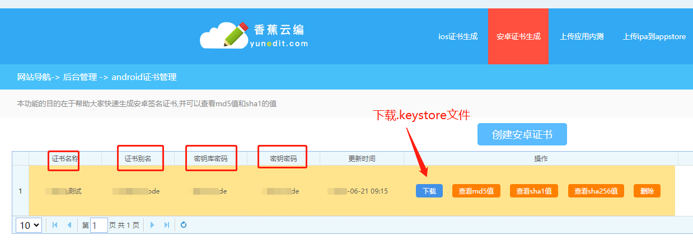

# [uniapp](https://uniapp.dcloud.net.cn/)

**[2023年了，uniapp发展的怎么样了?](https://www.zhihu.com/question/444976489)**

## 介绍

> `uni-app` 是一个使用 [Vue.js](https://vuejs.org/) 开发所有前端应用的框架，开发者编写一套代码，可发布到iOS、Android、Web（响应式）、以及各种小程序（微信/支付宝/百度/头条/飞书/QQ/快手/钉钉/淘宝）、快应用等多个平台。

> `uni-app`一套代码，运行到多个平台

**一个 uni-app 工程，就是一个 Vue 项目**


## 目录结构

> https://uniapp.dcloud.net.cn/tutorial/project.html

一个uni-app工程，默认包含如下目录及文件：

``` css
┌─.hbuilderx		   是开发该项目使用的工具HBuilderX的开发配置目录，一般不需要手工修改其内容。有了该目录别人在导入项目的时候，会默认使用你的开发工具配置信息。因为每个人使用开发工具的习惯不同，所以该目录一般不上传到版本管理仓库。
│─uniCloud              云空间目录，阿里云为uniCloud-aliyun,腾讯云为uniCloud-tcb
│─components            符合vue组件规范的uni-app组件目录
│  └─comp-a.vue         可复用的a组件
├─utssdk                存放uts文件
├─pages                 业务页面文件存放的目录
│  ├─index
│  │  └─index.vue       index页面
│  └─list
│     └─list.vue        list页面
├─static                存放应用引用的本地静态资源（如图片、视频等）的目录，注意：静态资源只能存放于此
├─uni_modules           存放[uni_module](/uni_modules)。
├─platforms             存放各平台专用页面的目录
├─nativeplugins         App原生语言插件
├─nativeResources       App端原生资源目录
│  └─android            Android原生资源目录
├─hybrid                App端存放本地html文件的目录
├─wxcomponents          存放小程序组件的目录
├─unpackage             非工程代码，一般存放运行或发行的编译结果
├─AndroidManifest.xml   Android原生应用清单文件
├─main.js               Vue初始化入口文件
├─App.vue               应用配置，用来配置App全局样式以及监听 应用生命周期
├─manifest.json         配置应用名称、appid、logo、版本等打包信息
├─pages.json            配置页面路由、导航条、选项卡等页面类信息
└─uni.scss              这里是uni-app内置的常用样式变量
```


## uniapp项目规范

``` js
1. font-size:20px;margin,padding,width;必须使用偶数，不能使用奇数
2. vue中定义全局方法必须 方法名称必须义$开头 $store
3. 全部使用单引号
4. 小程序 css 中 background 背景图不支持本地路径。解决办法改为网络路径或 base64。
5. 
```

> + 其实程序员写的代码都大同小异，开发的时候都是有代码规范的，这样等后面项目需要维护起来的时候就简单多了，易维护
> + 微信小程序中尽量减少animation的使用（大佬给我讲的），会造成卡顿之内的问题


## uniapp请求封装

### 目录结构（根目录开始）

``` bash
┣━━━  api				// 所有请求
┃	  ┣━━━  user.js    	// 用户请求api
┣━━━  utils				// 全局公共方法
┃	  ┣━━━  env.js		// 公共参数
┃	  ┣━━━  request.js   // 网络请求中间件
```

### **utils/env.js**(作为公共参数，像请求地址什么的)

``` js
"use strict";
/**
 * 公共参数
 */
// 后台api服务器基础路径
let baseUrl = null;

// 开发环境
if (process.env.NODE_ENV == "development") {
	baseUrl = "http://localhost:3000"
} else {	
	baseUrl = "http://www.codeman.ink"
}
/**
 * 	appid : 		小程序appid
 *  baseUrl : 		服务端域名
 */

// 变量可自行添加修改
export default { //存放变量的容器
	appid: '****',
	baseUrl
}


```

### **utils/request.js**

``` js
/**
 * 对uni.request进行二次封装
 */
import env from "./env.js"

const request = (options = {}) => {
	options.url = `${env.baseUrl}${options.url}`
	
	const token = uni.getStorageSync('token')
	// 判断本地是否存在token， 如果存在则带上请求头
	if (token) {
		options.header = {
			"content-type": "application/json",
			"Authorization": `Bearer ${token || false}`		// 这里是token（可自行修改）
		}
	}
	
	// 请求方法
	options.method = options.method || "GET"
	
	uni.showToast({
		title: "加载中...",
		icon: "loading",
		mask: true
	})
	
	// resolve是返回成功数据，reject返回错误数据
	return new Promise((resolve, reject) => {
		
		// 请求成功
		options.success = (res) => {	
			// 如果请求回来的状态码不是200则执行一下操作
			if (res.data.code !== 200) {
				// 非成功状态码弹窗
				uni.showToast({
					title: `${res.data.msg}`,
					icon: "none",
					duration: 2000
				})
				// 登录失效
				if (res.data.code === 403) {
					// 清除本地token
					removeToken()
					// 关闭所有页面返回到登录页
					uni.reLaunch({
						url: "/pages/login/login"
					})
				}
				// 返回错误信息
				reject(res)
			} else {
				uni.hideToast()
				// 请求回来的状态码为200则返回数据
				resolve(res.data)
			}
		}
		// 请求失败
		options.fail = (err) => {
			console.log(err)
			// 请求失败弹窗
			uni.showToast({
				title: "服务器错误，请稍后重试!",
				icon: "none",
				duration: 2000
			})
			// reject(err)
		}
		
		// 发请求（上面是配置选项）
		uni.request(options)
	})
}

export default request
```

### **api/user.js**

``` js
import request from '@/utils/request.js'

// 获取首页轮播图
export const getBanner = (type = 1) => {
	return request({
		url: '/banner',
		data: {
			type
		}
	})
}
```

### 页面中调用

``` vue
<template>
	<u-button @click="handleBanner">获取banner数据</u-button>
</template>


<script>
	export default {
        data() {
            return {
            	bannerList: []
        	}
        },
        methods: {
            // 获取轮播图
            async handleBanner() {
                const res = await getBanner()
                this.bannerList = res.banners.map(item => item.pic)
            },
        }
    }
</script>
```


## uniapp上传多张图片

> APP支持多张图片上传
>
> 微信小程序不支持多张图片上传，只支持单张


``` js
// 官网也说了：如果需要传多个文件需要反复调用API，所以跨端的写法就是循环调用本API

uni.chooseImage({  // 从本地相册选择图片或使用相机拍照
    success: (chooseImageRes) => {	// 拿到本地临时图片路径（chooseImageRes.tempFilePaths）
        chooseImageRes.tempFilePaths.forEach(item => {	// 遍历每一个url，需要循环chooseImageRes.tempFilePaths.length次请求
            uni.uploadFile({
                url: 'http://127.0.0.1:4000/upload', // 上传的url服务器地址
                fileType: 'image',		// 上传文件的类型
                filePath: item,			// 图片的本地临时资源路径
                name: 'file',
                formData: {			// 去除图片路径的其他方案，我这里是需要传递文章标题和文章内容，所以可以用这个传递参数
                  	'title': '标题示例',
                    'content': '内容示例'
                },
                header: {			// 请求头：你可以使用携带token的形式
                    'content-type': 'multipart/from-data'
                }
                success: (uploadFileRes) => {
                    uni.showToast({
                        title: '上传成功！'
                    })
                },
                fail: (err) => {
                    uni.showToast({
                        title: '上传失败！'
                    })
                }
            });
        })
    }
});


// 注：上传图片的路径（示例）：http://tmp/0XJSw9Fd3tIa624c8226fd429adddfd9a04a934d8c93.jpg
```


## uniapp分包

官方文档：**https://uniapp.dcloud.net.cn/collocation/pages.html#subpackages**

> #### 在小程序启动时，默认会下载主包并启动主包内页面，当用户进入分包内某个页面时，会把对应分包自动下载下来，下载完成后再进行展示。此时终端界面会有等待提示

> 注意：
>
> + 微信小程序每个分包的大小是2M，总体积一共不能超过20M
> + 分包下支持独立的 static 目录，用来对静态资源进行分包。

#### 第一步：首先，在uniapp结构里原本已经有一个pages的包（文件夹）了，我们在pages同级里新建一个pages-second包与pages-third包


#### 第二步：然后在pages.json文件中配置如下

``` json
{
	"pages": [ //pages数组中第一项表示应用启动页，参考：https://uniapp.dcloud.io/collocation/pages
		{
			"path": "pages/index/index",
			"style": {
				"navigationBarTitleText": "首页"
			}
		},
		{
			"path": "pages/order/index",
			"style": {
				"navigationBarTitleText": "订单",
				"enablePullDownRefresh": true
			}
		},
		{
			"path": "pages/user/index",
			"style": {
				"navigationBarTitleText": "我的"
			}
		},
		{
			"path": "pages/express/index",
			"style": {
				"navigationBarTitleText": "代取快递"
			}
		},
		{
			"path": "pages/runLeg/index",
			"style": {
				"navigationBarTitleText": "校园跑腿"
			}
		},
		{
			"path": "pages/lost/index",
			"style": {
				"navigationBarTitleText": "失物招领"
			}
		},
		{
			"path": "pages/accompany/index",
			"style": {
				"navigationBarTitleText": "陪"
			}
		},
		{
			"path": "pages/order/orderDetails",
			"style": {
				"navigationBarTitleText": "订单详情"
			}
		},
		{
			"path": "pages/personalCenter/index",
			"style": {
				"navigationBarTitleText": "个人中心"
			}
		},
		{
			"path": "pages/expenseBreakdown/index",
			"style": {
				"navigationBarTitleText": "费用明细"
			}
		},
		{
			"path": "pages/login/index",
			"style": {
				"navigationBarTitleText": "登录"
			}
		},
		{
			"path": "pages/myAddress/index",
			"style": {
				"navigationBarTitleText": "我的地址"
			}
		},
		{
			"path": "pages/addAddress/index",
			"style": {
				"navigationBarTitleText": "添加地址"
			}
		},
		{
			"path": "pages/order/myIssue",
			"style": {
				"navigationBarTitleText": "我的接单"
			}
		},
		{
			"path": "pages/order/myOrder",
			"style": {
				"navigationBarTitleText": "我的发布"
			}
		}
	],
    // 这里进行分包配置
	"subPackages": [
		{
			"name": "page-second",
			"root": "page-second",
			"pages": [
				{
					"path": "index",
					"style": {
						"navigationBarTitleText": "测试1"
					}
				}
			]
		},
		{
			"name": "page-third",
			"root": "page-third",
			"pages": [
				{
					"path": "index",
					"style": {
						"navigationBarTitleText": "测试2"
					}
				}
			]
		}
	],
	"globalStyle": {
		"navigationBarTextStyle": "black",
		"navigationBarTitleText": "工院派大星",
		"navigationBarBackgroundColor": "#F8F8F8",
		"backgroundColor": "#F8F8F8"
	},
	"tabBar": {
		"color": "#000000",
		"selectedColor": "#409eff",
		"backgroundColor": "#ffffff",
		"list": [
			{
				"text": "首页",
				"pagePath": "pages/index/index",
				"iconPath": "static/image/home.png",
				"selectedIconPath": "static/image/homefill-copy.png"
			},
			{
				"text": "订单",
				"pagePath": "pages/order/index",
				"iconPath": "static/image/form.png",
				"selectedIconPath": "static/image/formfill-copy.png"
			},
			{
				"text": "我的",
				"pagePath": "pages/user/index",
				"iconPath": "static/image/my.png",
				"selectedIconPath": "static/image/myfill-copy.png"
			}
		]
	},
	"easycom": {
		// 注意一定要放在custom里，否则无效，https://ask.dcloud.net.cn/question/131175
		"custom": {
			"^u-(.*)": "uview-plus/components/u-$1/u-$1.vue"
		}
	}
}
```


#### 第三步：做逻辑

``` vue
<template>
	<button @click="test01">测试1</button>
	<button @click="test02">测试2</button>
</template>

<script setup lang='ts'>
	const test01 = () => {
		uni.navigateTo({
			url: '/page-second/index'
		});
	}
	
	const test02 = () => {
		uni.navigateTo({
			url: '/page-third/index'
		});
	}
</script>
```


## 滚动穿透

+ 弹窗遮罩显示时，底层页面仍可滚动。给遮罩最外层 view 增加事件 `@touchmove.stop.prevent`

``` vue
<view class="pop-box" @touchmove.stop.prevent></view>
```


## 判断当前运行环境（H5  App）

> `uniapp`可通过`process.env.NODE_ENV`判断当前环境是开发环境还是生产环境，一般用于连接测试服务器或生产服务器的动态切换。
>
> 在HBuilderX中，点击【运行】编译出来的代码是开发环境，点击【发行】编译出来的代码是生产环境

``` js
if(process.env.NODE_ENV === 'development'){
    console.log('开发环境')
}else{
    console.log('生产环境')
}
```

## 微信小程序判断当前运行环境

``` js
// 微信小程序
// #ifdef MP-WEIXIN
const { miniProgram } = wx.getAccountInfoSync()		// 获取当前帐号信息

if (miniProgram.envVersion == "develop") {	// 开发环境
	uni.showToast({
		title: "开发环境~"
	})
	baseUrl = "http://localhost:3000"
} else if (miniProgram.envVersion == "trial") {	  // 体验环境
	uni.showToast({
		title: "体验环境~"
	})
	baseUrl = "https://www.codeman.ink"
} else {
	uni.showToast({		// 正式环境
		title: "正式环境~"
	})
	baseUrl = "https://www.codeman.ink"
}
// #endif
```

## 用户截屏事件api

> ​	https://uniapp.dcloud.net.cn/api/system/capture-screen.html

> 必须先让该方法调用一次，后面才会触发截屏里的回调函数

**例如**

``` js
// 方法不管在哪调用的，只有调用了才能在当前页面执行
onLoad() {
	uni.onUserCaptureScreen(function() {
        console.log('用户截屏了')
    });
}
```

## 设置屏幕亮度api

> https://uniapp.dcloud.net.cn/api/system/brightness.html

> 设置屏幕亮度中有一个bug，如果用户的手机是自动调节亮度的话，下次进来就生效了，再也不会触发设置亮度函数

## 性能优化

> https://uniapp.dcloud.net.cn/tutorial/performance.html

## 报错

1. 项目开发完毕，点击发行，控制台报错了？

   

**uniapp小程序发布的时候报错，如下：**


1. 解决方法：
   + 产生这个报错的原因是可能你项目从之前的移植过来的，然后替换了微信小程序的appid，但是HbuliderX里面没有manifest.json的没有重新获取，替换成当前小程序项目的appid之后，重新获取一下就好了


## 打包微信小程序

### 1. 发行


### 2. 填写相关信息


### 3. 确认发行

**注意：会自动打开微信开发者工具启动微信小程序项目**


### 4. 上传


### 5. 提交审核（完毕）

> #### 微信公众平台：https://mp.weixin.qq.com/


##  [打包Android](https://blog.csdn.net/weixin_45491473/article/details/113245789?ops_request_misc=&request_id=&biz_id=102&utm_term=uniapp%E6%89%93%E5%8C%85%E5%8F%91%E5%B8%83%E5%BA%94%E7%94%A8%E5%B8%82%E5%9C%BA&utm_medium=distribute.pc_search_result.none-task-blog-2~all~sobaiduweb~default-2-113245789.142^v88^control_2,239^v2^insert_chatgpt&spm=1018.2226.3001.4187)

**uniapp安卓打包apk发布软件商城**

### 1. 准备工作

``` js
1. uniapp的id
2. 秘钥：生成APP证书时设置的密码
3. uniapp软件包名
4. 应用签名
5. 证书别名：证书的名称
```

### 2. 生成Android平台签名证书(.keystore)-自有证书操作步骤

``` js
可以去第三方申请：https://www.yunedit.com/
```



### 3. 打包apk

1. 在HBuider中点击manifest.json进行基础配置、app图标配置、app启动页面配置、app模块配置、app权限配置等

   


......

### 4. 发行打包

``` js
注意： 
	1. 传统打包和安心打包都可以，涉及到商业机密就选安心打包
	2. 打包稍微有点慢，请耐心等待.
```


+ #### 控制台显示的信息

  

### 5. 打包完成


### 6. 发布到应用市场

>  最后根据各个软件商城需要的东西进行打包，发布到软件商城

360手机助手：http://dev.360.cn
百度手机助手： http://app.baidu.com
腾讯应用宝：http://open.qq.com
豌豆荚：http://developer.wandoujia.com
小米开放平台：http://dev.xiaomi.com
联想乐商店：http://open.lenovo.com/developer
搜狗手机助手：http://zhushou.sogou.com/open
OPPO应用商店:http://open.oppomobile.com
华为应用市场：http://developer.huawei.com
魅族应用中心：http://developer.meizu.com
三星应用商店：http://seller.samsungapps.com/join/joinNow.as
应用汇：http://dev.appchina.com
机锋市场：http://dev.gfan.com
乐视应用市场：http://open.letv.com/dev-web
联通沃商店：http://dev.wostore.cn
移动应用商场：http://dev.10086.cn
易用汇：http://dev.anzhuoapk.com
木蚂蚁：http://dev.mumayi.com
优亿市场：http://dev.eoemarket.com
冒泡堂：http://dev.mopo.com
N多网：http://www.nduoa.com/developer
锤子应用商店：http://dev.smartisan.com
爱奇艺应用商店：http://store.iqiyi.com
海信应用商店：http://dev.hismarttv.com
网易应用中心：http://zc.reg.163.com/regInitialized

## [打包Ios](https://blog.csdn.net/qq_40230735/article/details/125644732?ops_request_misc=%257B%2522request%255Fid%2522%253A%2522168731130916800225519111%2522%252C%2522scm%2522%253A%252220140713.130102334..%2522%257D&request_id=168731130916800225519111&biz_id=0&utm_medium=distribute.pc_search_result.none-task-blog-2~all~sobaiduend~default-4-125644732-null-null.142^v88^control_2,239^v2^insert_chatgpt&utm_term=%E6%9C%80%E6%96%B0uniapp%E6%89%93%E5%8C%85IOS%E5%B9%B6%E5%8F%91%E5%B8%83&spm=1018.2226.3001.4187)

> 需要公司提供苹果开发者账号即可

### 1. 打开苹果开发者官网

> https://developer.apple.com/

点击Account（账户）


### 2.  点击这个选项打开开发者配置

> 需要注册账号并花钱加入成为开发者才会显示这个选项，一般公司会提供苹果开发者账号的


### 3. 先配置证书Certificates


### 4. 这里需要上传一个CSR文件


### 5. 生成CSR文件

> 需要去这个网站[https://app.121xuexi.com](https://app.121xuexi.com/)生成，或者通过别的渠道生成CSR文件


### 6. 去上传刚刚下载的CSR文件


### 7. 下载苹果官网Certificates生成的CER文件

> 去[https://app.121xuexi.com](https://app.121xuexi.com/)生成uniappp打包需要的私钥证书p12文件


### 8. 生成uniapp打包需要的私钥证书p12文件

> 上传苹果开发者官网Certificates生成的CER文件


### 9. 添加标识符Identifiers

> 对应uniapp IOS打包的Bundle ID (AppID)选项


### 10. 添加安装测试app的苹果手机的UDID

> 后续步骤需要用到

苹果手机UDID获取方式：

+ 下载[爱思助手](https://www.i4.cn/)连接需要安装测试app的苹果手机获取（后面安装app也需要这个应用）
+ [蒲公英](https://www.pgyer.com/)
+ [香蕉云编](https://www.yunedit.com/udid)

### 11. 获取证书profile文件


> **选择我们添加的Identifiers标识**


> **选择我们添加的证书Certificates**


> **关联我们测试的苹果手机UDID设备**


> 设置配置profile文件名称，然后生成profile文件


### 12. 打包IOS应用


> 选择生成的profile文件


> 下载p12文件，添加到私钥证书


> 填写证书私钥密码，之前生成P12证书步骤有写


### 13. 打包！！！


### 14. 打包完成后的文件在这里

> 项目根路径unpackage下


### 15. 连接爱思助手安装应用测试

> 这两张图是网络上拿的。。


### 16. 发布到App Store上

> https://blog.csdn.net/y19910825/article/details/121497299?ops_request_misc=&request_id=&biz_id=102&utm_term=%E6%9C%80%E6%96%B0uniapp%E6%89%93%E5%8C%85IOS%E5%B9%B6%E5%8F%91%E5%B8%83&utm_medium=distribute.pc_search_result.none-task-blog-2~all~sobaiduweb~default-0-121497299.142^v88^control_2,239^v2^insert_chatgpt&spm=1018.2226.3001.4187
>
> 或
>
> https://note.youdao.com/ynoteshare/index.html?id=00a6cb53002d052c21aeddd4d1ded1c8

## 发布App

> 蒲公英：https://www.pgyer.com/

## 打包友情链接

[【 uniapp 】打包Android的apk(原生APP-云打包)，及发布测试](https://blog.csdn.net/weixin_56650035/article/details/127188365)

[Android平台签名证书(.keystore)生成指南](https://ask.dcloud.net.cn/article/35777)

[uni-app打包到上架Android , ios完整详细流程](https://zhuanlan.zhihu.com/p/389302743?utm_id=0)

[uni app 本地打包apk 教程](https://juejin.cn/post/7245583330241773625)

[uniapp 上架安卓应用商店]()

[uniapp 上架安卓应用商店](http://appshangjia.yimenapp.com/info@-uniapp--shang-jia-an-zhuo-ying-yong-shang-dian-36586.html)

[最新uniapp打包IOS详细步骤](https://blog.csdn.net/qq_40230735/article/details/125644732)

[Uniapp进行App打包——安卓端](https://blog.csdn.net/weixin_45727472/article/details/115255326?ops_request_misc=%257B%2522request%255Fid%2522%253A%2522168722591416800185883814%2522%252C%2522scm%2522%253A%252220140713.130102334..%2522%257D&request_id=168722591416800185883814&biz_id=0&utm_medium=distribute.pc_search_result.none-task-blog-2~all~sobaiduend~default-1-115255326-null-null.142^v88^control_2,239^v2^insert_chatgpt&utm_term=uniapp%E6%89%93%E5%8C%85Android&spm=1018.2226.3001.4187)

[uniapp从开发App到上架应用市场需要经历什么？](https://blog.csdn.net/qq_33888891/article/details/114300434?ops_request_misc=%257B%2522request%255Fid%2522%253A%2522168724201616800226568407%2522%252C%2522scm%2522%253A%252220140713.130102334.pc%255Fall.%2522%257D&request_id=168724201616800226568407&biz_id=0&utm_medium=distribute.pc_search_result.none-task-blog-2~all~first_rank_ecpm_v1~rank_v31_ecpm-5-114300434-null-null.142^v88^control_2,239^v2^insert_chatgpt&utm_term=uniapp%E6%89%93%E5%8C%85Android%E4%B8%8A%E4%BC%A0%E5%88%B0%E5%BA%94%E7%94%A8%E5%B8%82%E5%9C%BA&spm=1018.2226.3001.4187)

[通过uniapp打包生成的ipa安装包如何上架appstore](https://blog.csdn.net/weixin_45082961/article/details/129691495?ops_request_misc=%257B%2522request%255Fid%2522%253A%2522168724201616800226568407%2522%252C%2522scm%2522%253A%252220140713.130102334.pc%255Fall.%2522%257D&request_id=168724201616800226568407&biz_id=0&utm_medium=distribute.pc_search_result.none-task-blog-2~all~first_rank_ecpm_v1~rank_v31_ecpm-6-129691495-null-null.142^v88^control_2,239^v2^insert_chatgpt&utm_term=uniapp%E6%89%93%E5%8C%85Android%E4%B8%8A%E4%BC%A0%E5%88%B0%E5%BA%94%E7%94%A8%E5%B8%82%E5%9C%BA&spm=1018.2226.3001.4187)

[通过uniapp打包生成的ipa安装包如何上架appstore](https://blog.csdn.net/weixin_45082961/article/details/129691495?ops_request_misc=%257B%2522request%255Fid%2522%253A%2522168724201616800226568407%2522%252C%2522scm%2522%253A%252220140713.130102334.pc%255Fall.%2522%257D&request_id=168724201616800226568407&biz_id=0&utm_medium=distribute.pc_search_result.none-task-blog-2~all~first_rank_ecpm_v1~rank_v31_ecpm-6-129691495-null-null.142^v88^control_2,239^v2^insert_chatgpt&utm_term=uniapp%E6%89%93%E5%8C%85Android%E4%B8%8A%E4%BC%A0%E5%88%B0%E5%BA%94%E7%94%A8%E5%B8%82%E5%9C%BA&spm=1018.2226.3001.4187)

[普歌-uniapp安卓打包apk发布软件商城](https://blog.csdn.net/weixin_45491473/article/details/113245789?ops_request_misc=&request_id=&biz_id=102&utm_term=uniapp%E6%89%93%E5%8C%85%E5%8F%91%E5%B8%83%E5%BA%94%E7%94%A8%E5%B8%82%E5%9C%BA&utm_medium=distribute.pc_search_result.none-task-blog-2~all~sobaiduweb~default-2-113245789.142^v88^control_2,239^v2^insert_chatgpt&spm=1018.2226.3001.4187)
