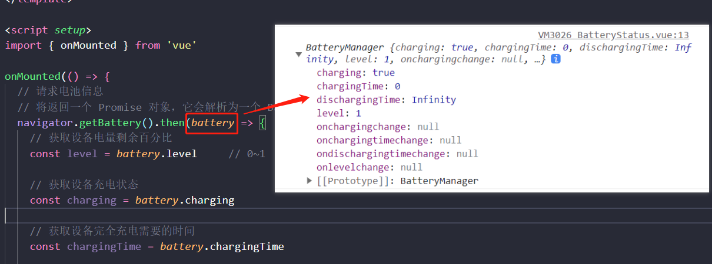

## 前端获取电池信息

> https://developer.mozilla.org/zh-CN/docs/Web/API/Battery_Status_API



### Battery Status API的使用

Battery Status API 是一个 Web API，允许 Web 应用程序访问用户设备的电池状态信息。使用这个 API，我们可以在不安装任何应用程序的情况下，从 Web 浏览器直接读取设备的电量信息。

获取设备电池信息的主要步骤如下：

``` js
// 请求电池信息
// 将返回一个 Promise 对象，它会解析为一个 BatteryManager 对象，我们可以使用它来读取设备的电池属性。
navigator.getBattery().then(battery => {
    // 获取设备电量剩余百分比
    const level = battery.level     // 0~1

    // 获取设备充电状态
    const charging = battery.charging

    // 获取设备完全充电需要的时间
    const chargingTime = battery.chargingTime

    // 获取设备完全放电需要的时间
    const dischargingTime = battery.dischargingTime
})
```

### 监听电池状态变化

为了更好地反映用户设备的电池状态，我们可以在前端中添加事件来监视电池状态的变化。例如，当设备的电池电量改变时，会触发事件。一些给大家列举几个常用事件：

``` js
navigator.getBattery().then(function (battery) {
  // 添加事件，当设备电量改变时触发
  battery.addEventListener('levelchange', function () {
    console.log('电量改变: ' + battery.level)
  })

  // 添加事件，当设备充电状态改变时触发
  battery.addEventListener('chargingchange', function () {
    console.log('充电状态改变: ' + battery.charging)
  })

  // 添加事件，当设备完全充电需要时间改变时触发
  battery.addEventListener('chargingtimechange', function () {
    console.log('完全充电需要时间: ' + battery.chargingTime)
  })

  // 添加事件，当设备完全放电需要时间改变时触发
  battery.addEventListener('dischargingtimechange', function () {
    console.log('完全放电需要时间: ' + battery.dischargingTime)
  })
})
```

