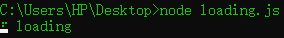

---
# 控制侧边栏的title的
title: Node.js
---

## 终端上的Loading动画是什么原理?
[GitHub源码链接](https://github.com/sindresorhus/ora/blob/main/index.js) 看了一下ora包，原理非常简单，核心代码如下：

运行代码后效果演示：


```js
const ora = () => {
  const stream = process.stderr;
  const spinner = {
    interval: 80,
    frames: [
      "⠋",
      "⠙",
      "⠹",
      "⠸",
      "⠼",
      "⠴",
      "⠦",
      "⠧",
      "⠇",
      "⠏"
    ],
  }
  let curIndex = 0;
  setInterval(() => {
    const frame = spinner.frames[curIndex++ % spinner.frames.length];
    stream.cursorTo(0);
    stream.write(frame + ' loading');
  }, spinner.interval);
}

ora();
```