# Vue2

## vue 兼容到 ie 几？

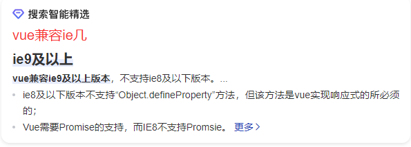

**ie9及以上**，不兼容IE8及以下版本。[链接地址](https://www.php.cn/vuejs/483396.html)

``` js
原因：
    1、IE8及一下版本不支持“Object.defineProperty”方法，但该方法是vue实现响应式的所必须的
    2、Vue需要Promise的支持，而IE8不支持Promsie。
```


## vue项目启动顺序

> https://www.jianshu.com/p/436ec9ac4bbe

1. vue3启动时，会先加载`public/index.html`文件，其中只要有：主要是提供一个`div` 给`vue` 挂载。

   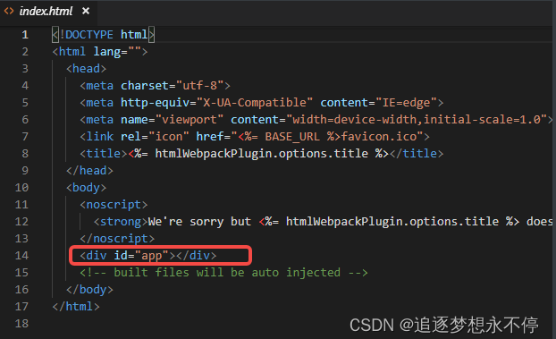

``` html
<div id="app"></div>
```

2. 然后，会加载main.js文件：

`main.js`中，引入了`Vue`、`App.vue`和`Router`模块，创建了一个`Vue`对象，并把`App.vue`的模板内容挂载到`index.html`的`id`为`app`的div标签下，并绑定了一个路由配置。

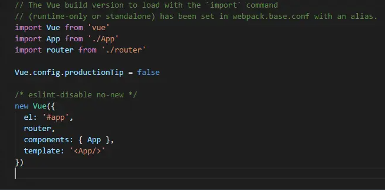

3. App.vue

上面 `main.js`把 `App.vue` 模板的内容，放置在了`index.html` 的 `div` 标签下面。查看 `App.vue`的内容我们看到，这个页面的内容由一个 `logo`和一个待放置内容的`router-view`，`router-view` 的内容将由`router` 配置决定。

<p align="center">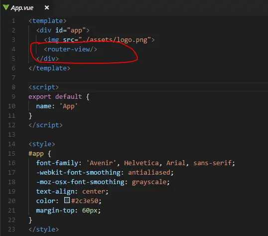</p>

4. router / index.js

查看`route` 目录下的`index.js`，我们发现这里配置了一个路由， 在访问路径`/` 的时候， 会把 `HelloWorld` 模板的内容放置到上面的`router-view`中。

<p align="center">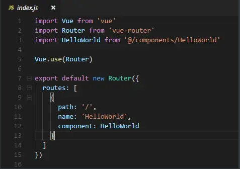</p>

5.  HelloWorld.vue

<p align="center">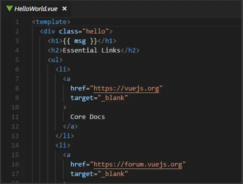</p>

6. 页面组成

​	所以，页面关系组成是 index.html 包含 App.vue，App.vue 包含 HelloWorld.vue 

<p align="center">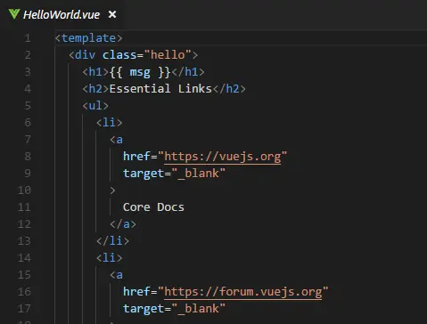</p>

## npm run dev 都做了什么

https://blog.csdn.net/web2022050901/article/details/125165316

> 在 `npm run dev`的时候，首先会去项目的`package.json`文件里找到`scripts`里找对应的`dev`，然后执行`dev`的命令
>
> 例如启动`vue项目 `npm run dev`的时候，实际上就是执行了`vue-cli-service serve`这条命令

+ 如果不存在dev命令，控制台则会抛出错误

​	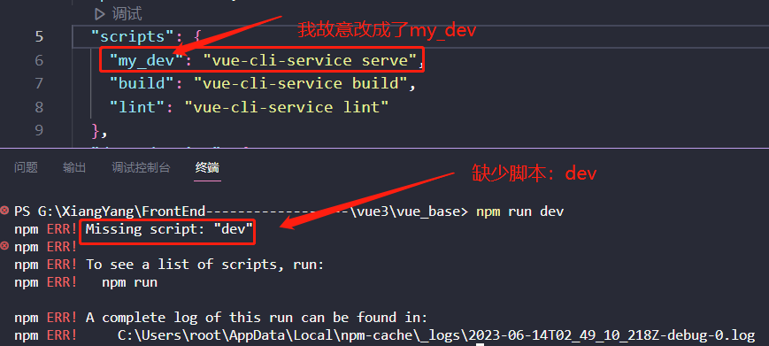

**注意：**

1. 那就有小伙伴会问了，那为什么不直接执行`vue-cli-service serve`命令呢？

    + 因为 直接执行`vue-cli-service serve`,会报错,因为操作系统中没有存在`vue-cli-service serve`这一条命令

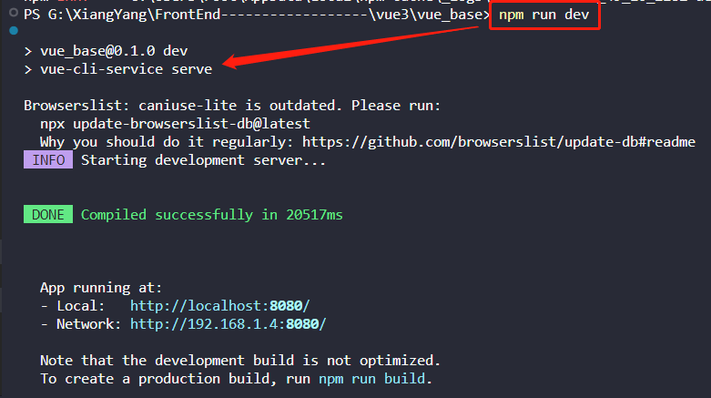

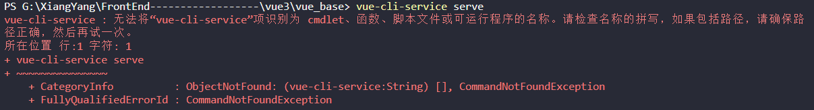

2. 那么就有的小伙伴要问了，既然`vue-cli-service serve`这条命令不存在操作系统中，为什么执行`npm run dev`的时候，也就是相当于执行了`vue-cli-service serve`,为什么这样它就能成功，而且不报指令存在的错误？

    + 我们在安装依赖的时候，是通过`npm install`来执行的，`npm`在安装依赖的时候，会在`node_modules/.bin/`目录中创建好`vue-cli-service`可执行文件
    
    + `.bin`目录不是任何一个npm包。目录下的文件，表示一个个软链接，打开文件可以看到文件顶部写着`#!/bin/sh`，表示这是一个脚本。
    
      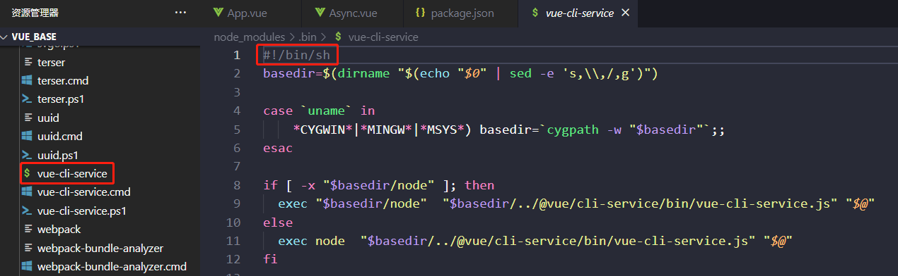

    + 所以当使用`npm run dev`执行`vue-cli-service serve`时，虽然没有安装`vue-cli-service`的全局命令，但是npm会到`./node_modules/.bin`中找到`vue-cli-service`文件找到脚本来执行，相当于执行了`./node_modules/.bin/vue-cli-service serve`。

3. 那可能有的小伙伴又会较真的问了，既然`./bin`目录下文件表示软链接，那这个bin目录下的那些软链接文件是哪里来的呢？它又怎么知道这条软链接是执行哪里的呢？

   + `bin`目录下的那些软链接存在于项目最外层的**`package-lock.json`**文件中。

   + 从`package-lock.json`中可知，当我们`npm install`整个新建的vue项目的时候，npm将`bin/vue-cli-service.js`作为`bin`声明了。

   + 所以在`npm install`时，npm读到该配置后。就将该文件软链接到 `./node_modules/.bin`目录下，而npm还会自动把`node_modules/.bin`加入`$PATH`，这样就可以直接作为命令运行依赖程序和开发依赖程序，而不用全局安装了。

   + 也就是说，`npm install`的时候，`npm`就帮我们把这种软链接配置好了，其实这种软链接相当于一种映射，执行`npm run dev`的时候，就会到`node_modles/.bin`中找到对应的映射文件，然后再找到相应的js文件来执行。

     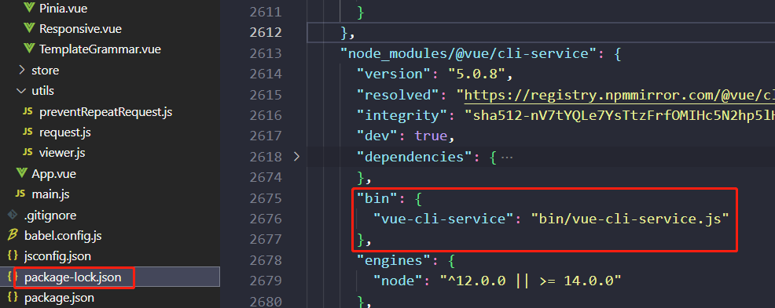


## 说一下 Vue生命周期

## 说一下 组件通信

## 说一下 Vuex

## 说一下双向数据绑定的原理

## 知道哪些vue指令

## 说一下自定义指令

## 说一下路由传参


## 生命周期父子组件执行顺序

## 过滤器有没有用过（什么场景）

## 用第三方库报错怎么办

## vmodel 是谁的语法糖

## query 和 params 区别

## vue怎么获取dom

## vue中的key有什么作用？（key内部的原理）

> 1、虚拟DOM中key的作用：
```js
 		key是虚拟DOM对象的标识，当状态中的数据发生变化时，vue会根据【新数据】生成【新的虚拟DOM】，随后Vue进行【新虚拟DOM】与【旧虚拟DOM】的差异比较，比较规则如下：

 2、对比规则：

 		（1）旧虚拟DOM中找到了与新虚拟DOM相同的key：

    - 若虚拟DOM中内容没变，直接使用之前的真实DOM！

    - 若虚拟DOM中内容变了，则生成新的真实DOM，随后替换页面中之前的真实DOM

      	（2）旧虚拟DOM中未找到与新虚拟DOM相同的key

           				创建新的真实DOM，随后渲染到页面

 3、用index作为key可能会引发的问题：

   - 若对数据进行：逆序添加、逆序删除等破坏顺序操作：

     	会产生没有必要的真实DOM更新 ==> 界面效果没问题，但效率低

   - 如果结构中还包含输入类的DOM：

     	会产生错误DOM更新 ==> 界面有问题

 4、开发中如何选择key？

 1. 最好使用每条数据的唯一标识作为key，比如id、手机号、身份证号、学号等唯一值
 2. 如果不存在对数据的逆序添加、逆序删除等破坏顺序的操作，仅用于渲染泪飙用于展示，使用index作为key是没有问题的
```
## 为什么组件data必须是函数？

 如果data是一个函数的话，这样每复用一次组件，就会返回一份新的data，类似于给每个组件实例创建一个私有的数据空间，让每个组件实例维护各自的数据，而单纯的写成对象形式，就使得所有组件实例共用一份data，就会造成一个变了全都会变的结果。

 所以说vue组件的data必须是函数，这都是js的特性带来的，跟vue本身设计无关。

 js本身的面向对象编程也是基于原型链和构造函数，应该会注意原型链上添加一般都会一个函数方法而不会去添加一个对象了。
