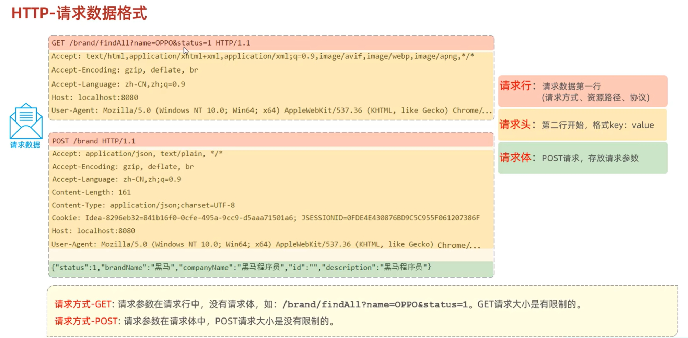
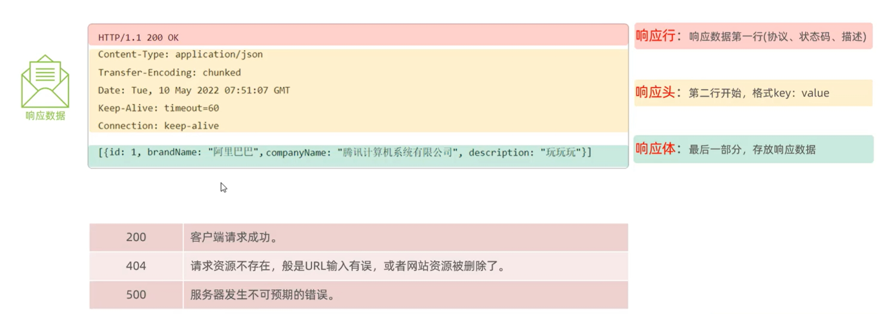
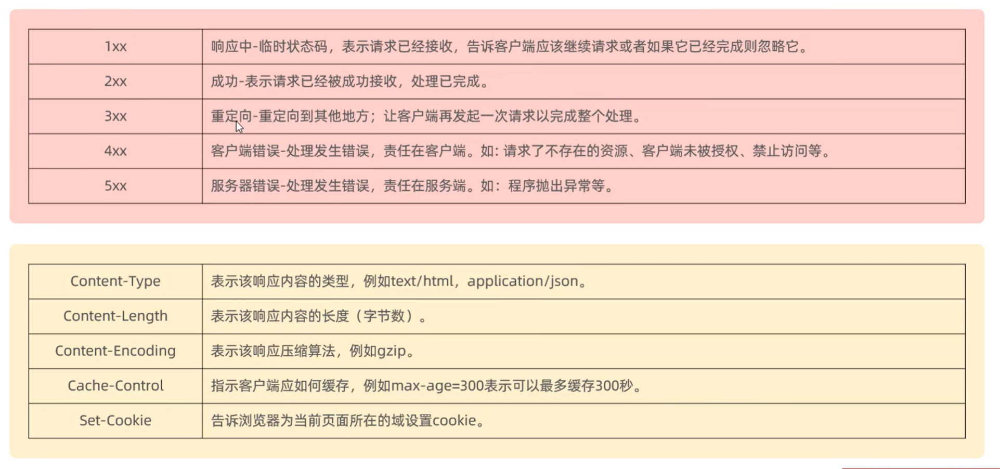
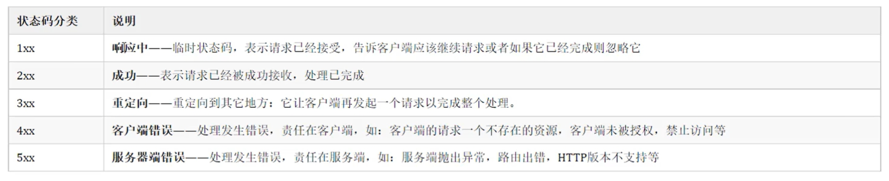
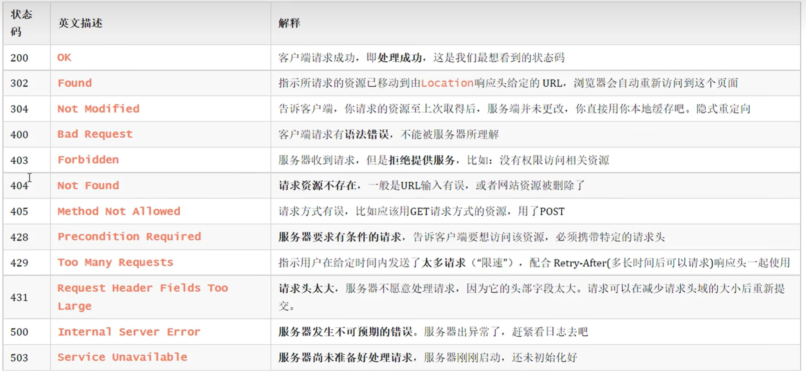

::: danger 温馨提示 
什么是Http？
:::

## HTTP概述

+ Hyper Text Transfer Protocol, 超文本传输协议，规定了浏览器和服务器之间数据传输的规则

**特点：**

1. 基于TCP协议：面向连接，安全
2. 基于请求-响应模型的：一次请求对应一次响应
3. HTTP协议是无状态的协议：对于事物处理没有记忆能力。每次请求-响应都是独立的。
   + 缺点：多次请求见不能共享数据
   + 优点：速度快

## HTTP请求协议

## HTTP响应协议

## 一、状态码大类

### 二、常见的响应状态码

**状态码大全：https://cloud.tencent.com/developer/chapter/13553**

