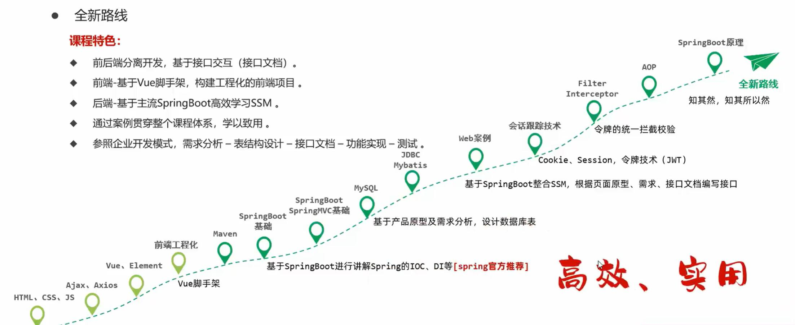
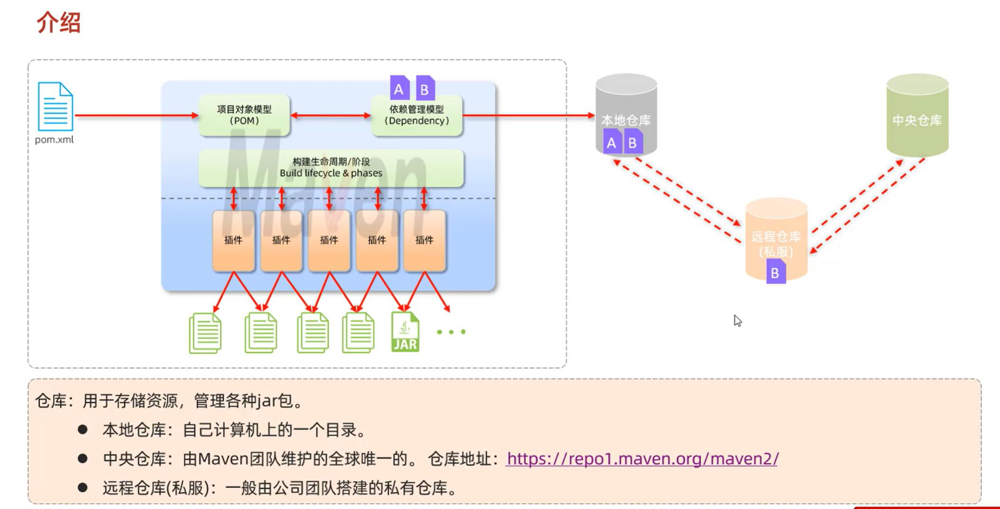
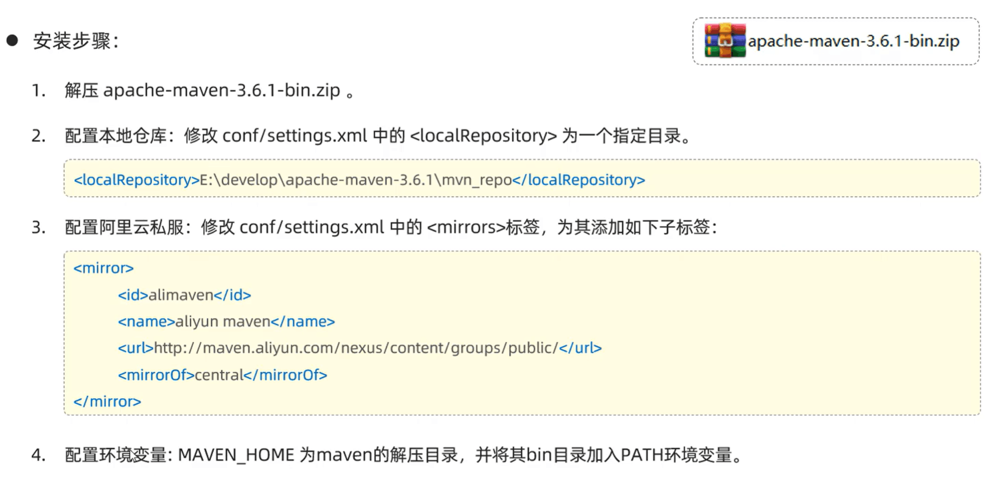
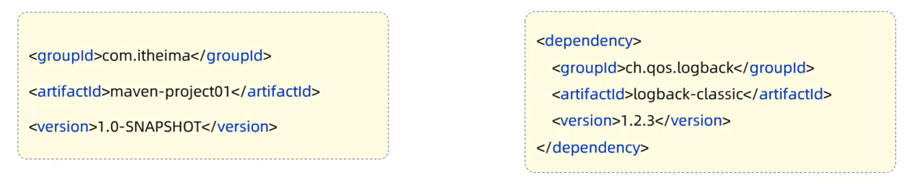
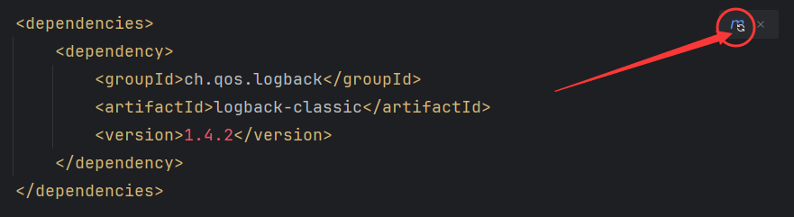
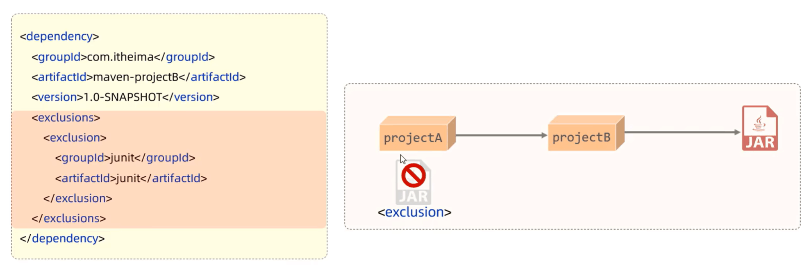
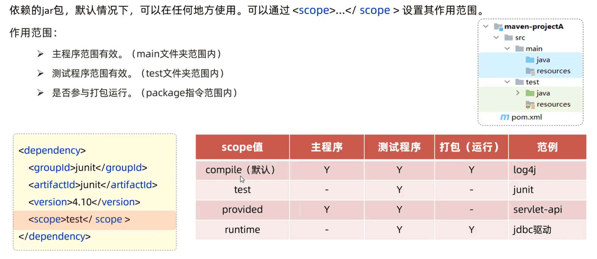

::: danger 温馨提示 
什么是Maven？
:::




## 介绍

> Maven是一款管理和构建java项目的工具。
>
> Maven是apache旗下的一个开源项目，是一款用于管理和构建java项目的工具。
>
> 它基于项目对象模型（POM）（Project Object Model）的概念，通过一小段描述信息来管理项目的构建。

`Apache软件基金会，成立于1999年7月，是目前世界上最大的最受欢迎的开源软件基金会，也是一个专门为支持开源项目而生的非盈利性组织。`

> 开源项目：https://www.apache.org/#apache-project-list

## 作用

1. 依赖管理

​	方便快捷的管理项目依赖的资源（jar包），避免版本冲突问题

2. 统一项目结构

​	提供标准、统一的项目结构

3. 项目构建

​	标准跨平台（Linux、Windows、MacOS）的自动化项目构建方式



## 安装

> https://maven.apache.org/download.cgi




## Maven坐标

+ 什么事坐标

  > Maven中的坐标是资源的唯一标识，通过该坐标可以唯一定位资源位置。
  >
  > 使用坐标来定义项目或引入项目中需要的依赖

+ Maven坐标主要组合

  1. groupld: 定义当前Maven项目隶属组织名称（通常是域名反写，例如：com.zxycode）
  2. artfactld：定义当前Maven项目名称（通常是模块名称，例如 order-service、goods-service）
  3. version：定义当前项目版本号




## 依赖配置

+ 依赖：指当前项目运行所需要的jar包，一个项目中可以引入多个依赖
+ 配置

		1. 在pom.xml中编写<dependencies>标签
		1. 在<dependencies>标签中 使用<dependency>引入坐标
		1. 定义坐标的groupld，artifactId、version
		1. 点击刷新按钮，引入最新加入的坐标



**注意：如果引入的依赖，在本地仓库不存在，将会连接远程仓库/中央仓库，然后下载依赖。（这个过程会比较耗时，耐心等待）**

**如果不知道依赖的坐标信息，可以到 https://mvnrepository.com/ 中搜索**


## 依赖传递

+ 排除依赖指主动断开依赖的资源，被排除的资源无需指定版本。




## 依赖范围




## 生命周期


## 总结

1. Maven生命周期

``` java
clean:   清理
complie：  编译
test：  测试
package：  打包
install：  安装
```


