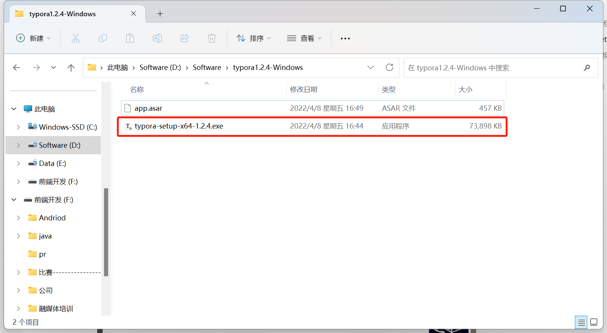
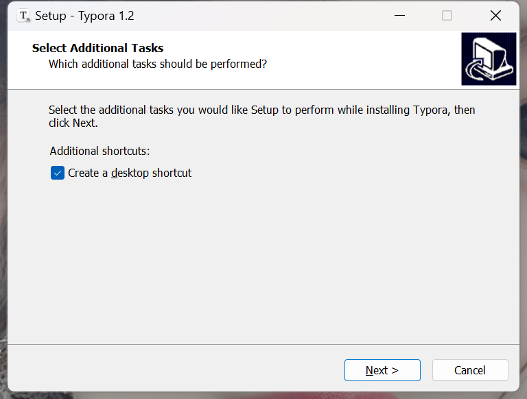
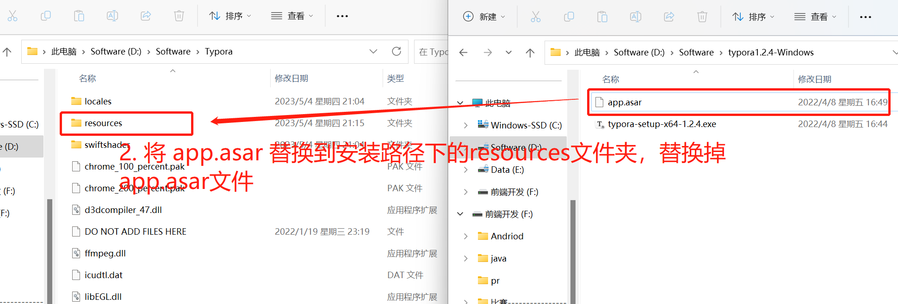
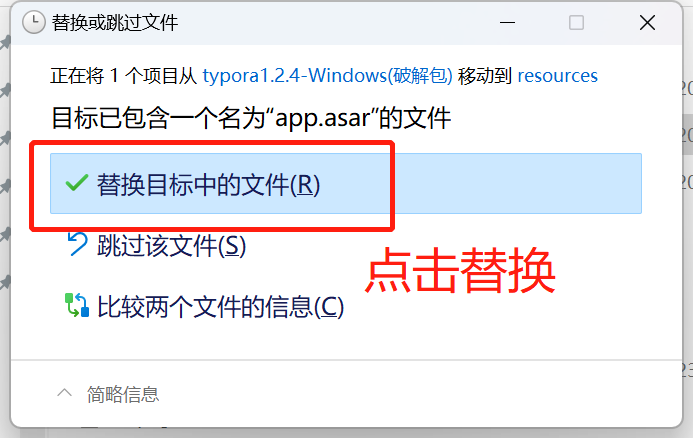
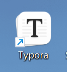
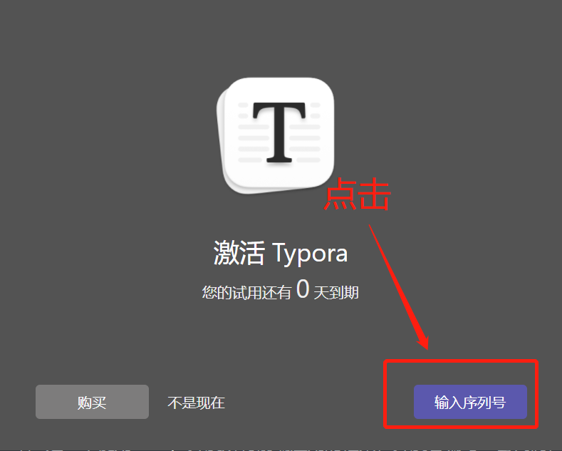
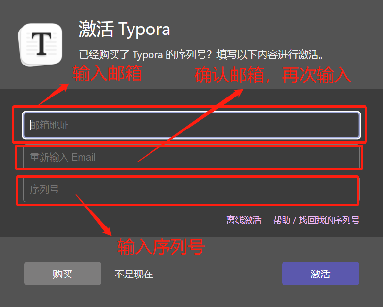
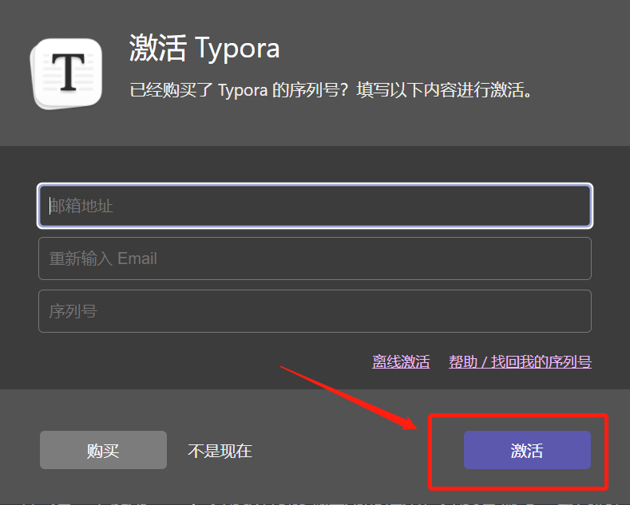
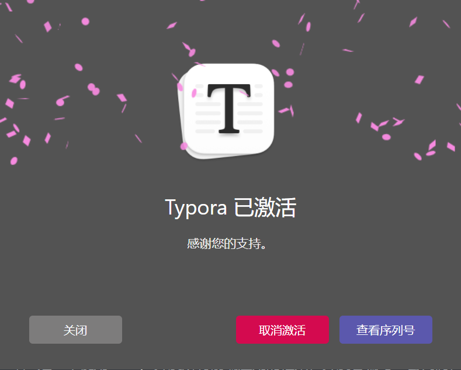

# Typora

> Typora 是一款跨平台轻量级 Markdown 编辑器

::: danger 温馨提示
仅供学习，请在下载 24 小时之内删除，请支持正版
:::

## 1. 打开解压后安装包目录

## 2. 安装 typora-setup-x64-1.2.4.exe ，记下安装路径

- 一直 `Next` 下一步
  

## 3. 将 app.asar 替换到安装路径下的 resources 文件夹，替换掉 app.asar 文件

---

## 4. 重启 typora！！！！！！

## 5. 点击输入序列号

- 输入邮箱、注册码
  

## 6. 点击激活

## 7. 激活成功

